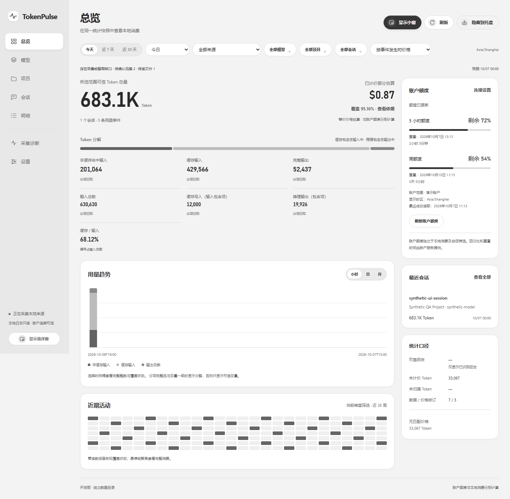
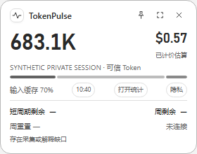
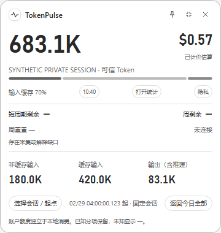

# TokenPulse

**把 Codex 的本地 Token 用量、参考费用和账户额度放到桌面上。**

[](https://github.com/LiuYongXinn/token-pulse/releases/latest)
[](#安装)
[](LICENSE)

[下载安装包](https://github.com/LiuYongXinn/token-pulse/releases/latest) · [使用指南](docs/development/user-guide.md) · [常见问题](docs/development/faq.md) · [参与贡献](docs/development/contributing.md) · [文档索引](docs/README.md)

当前发布版本：[1.0.1](https://github.com/LiuYongXinn/token-pulse/releases/tag/v1.0.1)。更新内容与验签记录见[发布与更新包](docs/development/releases.md)。

TokenPulse 是独立运行的 Windows 桌面工具。它只读采集已配置的 Codex 本地日志，在完整统计窗口、桌面悬浮窗和 Windows 任务栏中展示用量，帮助你查看今天用了多少 Token、哪些模型和项目消耗较多，以及已有数据可以估算多少费用。

账户额度是可选功能，通过本地 Codex 账户服务复用已有登录，显示剩余比例和重置时间。本地消费、参考费用与账户额度使用各自的数据口径。

## 功能

| 功能 | 可以做什么 |
| --- | --- |
| 本地用量统计 | 查看 Token 总量、输入、缓存命中、缓存写入和输出；缺失分项明确保留为未知 |
| 多维分析 | 按日期、来源、模型、项目和会话筛选，查看趋势、近期活动及逐条用量明细 |
| 会话详情 | 显示本地线程标题、独立上下文信息、可识别回合和消费依据 |
| 参考费用 | 内置离线价格目录，支持自定义价格、模型别名、历史价格和后台费用重估 |
| 桌面悬浮窗 | 紧凑 / 展开两种模式，可固定会话范围、置顶、调整透明度及恢复交互 |
| Windows 任务栏 | 常驻显示读数，悬停查看详情，单击打开小窗、双击打开同范围统计 |
| 账户额度 | 可选连接本地 Codex 服务，显示服务提供的额度窗口、剩余比例和重置时间 |
| 显示与隐私 | 浅色、深色及跟随系统主题；共享隐私模式隐藏金额、路径和敏感名称 |
| 来源与诊断 | 管理来源、暂停采集、查看采集问题，并明确重读已启用来源 |
| 应用更新 | 通过 GitHub Releases 获取更新，校验项目签名及其绑定的版本 |

## 界面预览

以下图片来自正式 React 界面与测试专用合成数据，展示银雾主题的布局与交互；数值、账户和会话名称用于演示，不代表新安装默认值或真实账户额度。截图拍摄于此前版本，后续控件细节以当前应用为准。



| 紧凑悬浮窗 | 展开悬浮窗 |
| --- | --- |
|  |  |

更多页面见[银雾界面展示](docs/design/silver-mist-ui.md)，包括深色主题、会话详情、明细、来源和设置。

## 安装

面向用户的发布包为 **Windows x64 NSIS 安装器**，当前实际验证以 Windows 10 为主。macOS、Linux 和 Windows ARM64 暂未提供经过本项目验收的安装包。

1. 打开 [GitHub Releases](https://github.com/LiuYongXinn/token-pulse/releases/latest)，下载 `TokenPulse_<版本>_x64-setup.exe`。
2. 运行安装器，选择当前用户可写的本地安装目录。
3. 启动 TokenPulse，通过托盘打开统计窗口。
4. 进入“设置 → 数据来源”，检测本地来源，或选择自己的 Codex Home，确认后启用采集。

运行依赖 Microsoft Edge WebView2。安装包配置了运行时引导下载；首次安装缺少 WebView2 时需要网络。普通用户无需安装 Node.js、Rust 或编译工具。

**版本提示：** 1.0.0 对系统盘安装存在限制；1.0.1 的源码与构建已取消这一限制，支持可写的本地盘符。下载版本及更新内容以 Releases 页面为准。详细发布记录见[发布与更新包](docs/development/releases.md)。

## 开始使用

首次采集需要读取已有日志，数据量较大时请等待采集完成，并在“采集诊断”查看来源状态。

1. 在总览选择“今天”“近 7 天”“近 30 天”或自定义日期，查看当前范围的用量。
2. 切换模型、项目、会话和明细页面，查看消耗来源与计价依据。
3. 从主窗口显示悬浮窗，或启用“任务栏显示”，按需保持读数可见。
4. 需要账户额度时，在数据来源设置中选择本地 Codex 程序及已登录的 Home，保存配置后明确连接。

关闭统计窗口或隐藏悬浮窗后，后台采集仍可继续；需要结束应用时从托盘明确退出。完整步骤见[使用指南](docs/development/user-guide.md)。

## 如何理解统计结果

- **Token 用量**来自已采集的本地日志，受当前日期、来源和会话等筛选条件影响。缓存命中包含在输入中，推理输出包含在输出中，不能重复相加。
- **费用是参考估算**。默认 Standard 报价、上下文档位或未知缓存写入量的假设会在明细中说明；估算不等于订阅账单或实际扣款。
- **账户额度独立计算**。来自本地账户服务返回的当前账户额度窗口，不随本地日期 / 会话筛选变化，也不能从估算美元金额换算。
- **未知值与零不同**。缺少证据的分项、未计价部分和未提供的额度保留未知状态，可信 Token 总量仍可显示。

有关估算依据，见[默认参考费用估算](docs/requirements/reference-estimates.md)；有关缺失数据和常见状态，见[FAQ](docs/development/faq.md)。

## 数据与隐私

本地日志作为只读来源。应用自己的统计数据库、设置和 WebView 数据放在 `.local/` 下；开发版与正式版使用不同数据目录。独立安装时，默认以可执行文件所在目录为根；也可通过 `TOKENPULSE_PROJECT_ROOT` 显式指定本地根目录。

隐私模式控制界面展示，会隐藏费用、路径和敏感名称；它不加密数据库，也不删除来源日志。账户连接和检查更新需要相应服务的网络访问。路径约定见[本地数据与缓存](docs/development/project-local-storage.md)。

## 开发与贡献

项目使用 **Tauri 2 + Rust + React + TypeScript + SQLite**。Windows 原生任务栏宿主是独立 Rust 进程。

当前发布代码在 `codex/release/1.0.0` 分支，分支名称保留，应用版本以该分支的版本配置为准。开发当前发布代码可从这个分支开始：

```powershell
git clone --branch codex/release/1.0.0 https://github.com/LiuYongXinn/token-pulse.git
cd token-pulse
npm ci
npm run dev
```

`npm run dev` 提供浏览器界面预览，普通浏览器不连接桌面采集器或账户服务。首次桌面开发还需按[贡献指南](docs/development/contributing.md)准备 PowerShell 7、Rust MSVC 工具链、C++ 构建工具和 WebView2，再运行 `npm run tauri:dev`。

欢迎通过 [Issues](https://github.com/LiuYongXinn/token-pulse/issues) 报告问题或提出改进，通过 Pull Request 贡献代码和文档。提交问题时请附应用版本、Windows 版本、复现步骤和脱敏截图。

## 文档

| 想了解什么 | 从这里开始 |
| --- | --- |
| 安装、配置来源、使用三种显示入口 | [使用指南](docs/development/user-guide.md) |
| 没有数据、未计价、额度未连接等问题 | [常见问题](docs/development/faq.md) |
| 环境搭建、开发命令、检查与贡献 | [贡献指南](docs/development/contributing.md) |
| 模块边界、采集、存储和 IPC | [详细开发设计](docs/design/development-design.md) |
| 构建安装包、签名及更新元数据 | [发布与更新包](docs/development/releases.md) |
| 已验证的功能与实际系统验证范围 | [交付记录](docs/development/delivery-status.md) |
| 全部文档 | [文档索引](docs/README.md) |

## 许可证

本项目采用 [MIT License](LICENSE)，与 Cargo workspace 的许可证声明一致。第三方依赖保留各自许可证，正式安装包包含 `THIRD_PARTY_NOTICES.txt`。

TokenPulse 是独立的社区项目，与 OpenAI 无隶属或背书关系。
