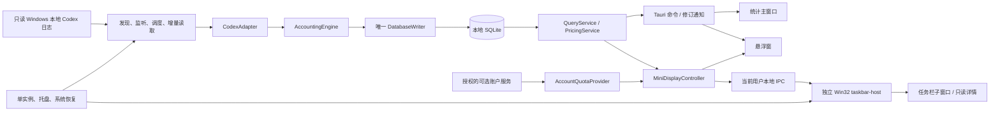
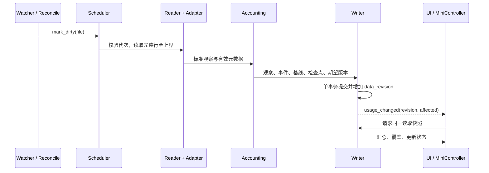

# TokenPulse 详细开发设计

当前范围以[实施计划第 7 节](../development/implementation-plan.md#7-已确认的剩余功能范围2026-10-02)为准：保留 notify、自动更新、费用缓存 / 后台重估、模型别名 / 离线价格、Windows 10 / 11 / 多屏 / DPI、任务栏和账户额度；诊断简化、打包采用简单版；取消旧格式自动重解析、额外快捷键、开机启动及 macOS / WSL / 网络来源适配。

状态：持续实施，M01–M12 已有可运行工程与分模块实现，部分真实环境验收尚未完成。M13 已接 Win10 原生嵌入、独立宿主 / 受控管道、菜单、只读详情及正式窗口动作；通知区左侧与应用图标右侧均已接通，实际按钮增减重排已在 Win10 验证。真实输入 / 完整 Explorer 生命周期 / 实际拥挤及自动隐藏 / Win11 / 物理多屏 DPI 仍待完成。实际交付以[实施记录](../development/delivery-status.md)为准。设计起始日期：2026-10-01；进度更新：2026-10-02。目标仓库：`E:/Documents/Code/token-pulse`。

本文件是开发总入口，将现有功能方案与已确认 UI 转成模块、状态、数据流、交付顺序和验收约束。开发者应先阅读本文，再按任务阅读专题；不能以 HTML 演示数据替代真实采集实现。

## 1. 设计依据与适用范围

|依据|用途|
|---|---|
|[完整功能与技术方案](token-pulse-design.md)|F01–F12 功能、统计准确性、独立运行、恢复和原始 A01–A16 验收要求|
|[UI 方案](token-pulse-ui.md)及[可操作原型](../../prototypes/token-pulse-ui.html)|七个主页面、文字导航、深灰风格、绿色费用、筛选、详情与小窗|
|[账户额度方案](account-quota.md)|短周期 / 周剩余百分比、重置、独立账户数据源|
|[任务栏方案](taskbar-display.md)|任务栏常驻读数、详情、设置、Windows 宿主及失败回退|
|[数据与存储详细设计](data-storage.md)|实体、建表草案、事务、查询一致性、计价精度与迁移|
|[采集与核算详细设计](collection-accounting.md)|文件状态机、格式适配、计数流、去重、分叉、重建与夹具|
|[IPC 与前端契约](ipc-contracts.md)|DTO、命令、事件、分页、快照、权限和错误|
|[开发实施与验收计划](../development/implementation-plan.md)|任务依赖、逐模块交付、自动检查与原生验收|

本文和专题共同构成一份开发设计。按仓库约定将需求依据、技术专题与开发流程分开保存；功能定义继续引用现有完整方案，不复制为另一份相互冲突的需求。

### 1.1 已确认需求的统一

|旧描述或演示边界|本次实施口径|
|---|---|
|小窗约 280×160 / 360×320|紧凑 280×220 DIP，展开 360×380 DIP；随字体缩放测量并防止溢出|
|只含主窗口与小窗|新增 Windows 任务栏模式，三个入口共享后台|
|账户额度不属于工具职责|日志采集器仍不读取账户认证；新增独立、可选的额度服务连接|
|TokenPulse 新登录 / 设备码流程|2026-10-02 用户确认复用本地已登录的 Codex 账户；不新增登录、设备码或取消登录功能|
|两窗口共享外观|主窗口与小窗共享应用主题；任务栏文字融入系统背景；三者共享隐私|
|原型含数据与备份页签|正式设置保留数据来源、显示与窗口、任务栏显示、价格规则四页签；取消数据与备份页签|
|原型固定今日和演示会话|正式应用采用配置时区和实时日期；演示工具栏及价格不进入生产|
|热力图在主筛选旁展示|明确为近 26 周独立日期范围，继承维度筛选；点击日期更新主筛选|

冲突处理：上述已确认变化优先于旧尺寸和旧职责边界；统计准确性、原始日志只读、未知值不置零等约束始终有效。后续变更需要同时更新受影响的专题和验收项。

### 1.2 功能追踪

|需求|开发模块|通过依据|
|---|---|---|
|F01 来源管理|SourceRegistry、SourcePanel|目录规范化、别名检测、暂停、不可读恢复、移除不删源日志|
|F02 历史导入|JobManager、CollectorScheduler|可观测进度、安全取消、重启恢复、历史与实时算法一致|
|F03 持续采集|后台进程、watcher、核对任务|窗口隐藏仍采集，重启和唤醒补漏|
|F04 悬浮显示|MiniDisplayController、FloatingWindow|费用、范围、置顶、位置、隐私和恢复交互|
|F05 完整统计|QueryService、七页面|统一筛选、同快照、分页、覆盖状态|
|F06 会话查看|SessionService、SessionDrawer|消耗与上下文分开，可靠回合及父子关系|
|F07 计价|PricingService、PriceRuleEditor|可追溯规则、精确计算、未计价、重估|
|F08 简化诊断|DiagnosticService、DiagnosticsPage|来源状态、错误原因、必要定位、基本重建进度；不做完整历史 / 证据浏览器 / 原文采样|
|F09 重建纠正|RebuildCoordinator|候选结果验证、原子切换、失败不破坏旧账本|
|F10 已取消：导出备份|不实施对应产品服务|2026-10-02 用户取消 M14，不纳入交付与验收|
|F11 系统集成|AppShell、Windows 适配|托盘、单实例、notify 可选且可撤销；不做开机启动或额外快捷键|
|F12 基本维护|既有存储初始化 / 迁移、Updater|普通错误提示、更新验证、卸载不修改源日志；不追加迁移保护或专门故障恢复|
|F13 新增：账户额度|AccountQuotaProvider|周期由返回值识别，独立快照、缺失、过期与切换账户|
|F14 新增：任务栏模式|TaskbarHostManager、WindowsTaskbarAdapter|不重叠、可恢复、可回退；Windows 版本分别验收|

F13/F14 是需求增补编号。2026-10-02 用户取消 M14，对应 F10 与 A13 停用，编号保留；统计导出、手动备份、备份恢复、跨设备离线恢复及应用内数据清除不纳入交付。迁移保护和专门故障恢复不再追加开发或专项验收；已实现内部机制保持现状，基本统计正确性、重建和原始日志只读仍有效。阶段划分表示其余有效功能的开发依赖。

## 2. 技术选型与工程边界

|层|选型|理由与限制|
|---|---|---|
|桌面壳|Tauri 2|窗口、托盘、命令、事件、安装；后台由 Rust 进程持有|
|前端|React + TypeScript + Vite|按页面和共享组件拆分，生产构建本地静态资源|
|前端状态|React 状态 + 小型显式 store + QueryClient 封装|筛选和窗口设置与服务端快照分开；不由组件维护累计用量|
|图表|SVG 堆叠柱图、HTML 热力图|当前需求结构简单，复用原型视觉；避免为基础图表引入大型依赖|
|后台调度|Tokio + 有界任务 / 阻塞池|异步编排；文件解析与 SQLite 同步访问不堵塞事件循环|
|数据库|rusqlite + bundled SQLite|一个专用写线程，受限只读连接，事务和备份明确；不向 WebView 开放 SQL|
|监听与解析|notify、serde / serde_json|监听作为提示；格式适配与账本分离|
|时间|chrono + chrono-tz|UTC 存储、IANA 时区边界与夏令时测试|
|数值|i64 原始 Token、checked i128 聚合 / 金额|IPC 十进制字符串；精度规则见存储专题|
|Windows 原生|Rust windows 绑定 + 独立 taskbar-host|任务栏绘制和宿主识别与 Tauri WebView 隔离|
|日志|tracing + 轮转文件|结构化指标，不记录正文、认证或原始 IPC 载荷|
|验证|Rust 单元 / 集成 / 故障测试，Vitest，Playwright|浏览器测试验证前端，Windows 虚拟机验证系统行为|

以上为选型，不是当前已安装依赖。创建工程时按兼容的稳定版本生成并提交 `Cargo.lock` 与前端锁文件，记录 Rust / Node / SQLite / Codex 版本；不以本文日期猜测补丁版本。Node 仅用于开发构建，发布应用不依赖系统 Node、IDEA 或 TokenTracker CLI。

Tauri 使用命令处理结构化调用、事件通知变化，具体契约见专题。[Tauri 官方通信文档](https://v2.tauri.app/develop/calling-rust/)

## 3. 进程与模块架构



`token-pulse` 主进程持有数据库、采集器、查询服务、账户连接和 Tauri 壳。主窗口与小窗均为这个进程管理的 WebView；不各自启动采集器。`taskbar-host` 只接收经过隐私处理的展示快照和受限动作，不访问日志、数据库或认证。

额度适配使用用户选择的 Codex App Server 独立子进程或明确支持的服务连接，不旁听 Codex 桌面应用内部连接。该可选能力不可用时，本地统计和估算仍正常运行。

### 3.1 模块接口与所有权

|模块|输入 / 输出|持有状态|不得承担|
|---|---|---|---|
|AppRuntime|启动参数、系统事件 → 服务启动 / 停止|生命周期、实例锁、服务句柄|解析日志或计算增量|
|SourceRegistry|目录选择 → source_id 与能力|来源配置、规范路径、来源状态|删除原始日志|
|CollectorScheduler|脏文件 / 核对 → ReadTask|队列、优先级、锁和取消令牌|直接变更 UI 数字|
|JsonlReader|检查点 → 完整字节记录与新位置|本批缓冲、读取上界|持久化正文或擅自推进偏移|
|CodexAdapter|完整记录 + 上下文 → 标准观察|格式版本和记录上下文|数据库写入、计价|
|AccountingEngine|有效观察序列 + 基线 → AccountingBatch|确定性计数状态|文件系统、窗口、网络|
|DatabaseWriter|校验过的 WriteBatch → CommitReceipt|唯一写连接、修订号|长时间解析与窗口绘制|
|QueryService|结构化筛选 → 一致查询结果|只读连接、查询缓存|修改检查点|
|PricingService|事件向量 + 价格版本 → 精确估算|不可变规则版本、重估缓存|推断实付与额度|
|JobManager|作业命令 → 持久任务与进度|状态机、检查点、取消|吞掉失败或强制终止事务|
|AccountQuotaProvider|连接配置 → 额度快照|连接 epoch、额度 revision、通知 / 退避|读取本地日志认证或交易 / 重置额度|
|MiniDisplayController|用量 + 额度 + mini_scope → MiniSnapshot|展示范围、隐私、两个独立修订|把两个来源伪装成同一数据时间|
|PlatformServices|结构化动作 → 原生结果|窗口位置、托盘、已有交互恢复快捷键|提供通用 shell 命令|

核心库对 Tauri、React 和 HWND 无依赖，方便在无 GUI 测试中验证采集与账本。运行层注入 Repository、Clock、FileSystem 和事件发送器，不在核心读取全局状态。

### 3.2 建议目录

```text
token-pulse/
  ui/src/
    app/              AppShell、导航、路由、错误边界
    pages/            overview、models、projects、sessions、events、diagnostics、settings
    floating/         紧凑 / 展开窗口入口
    features/         sources、pricing、quota、taskbar、jobs
    shared/           DTO、查询客户端、格式化、组件、设计变量
  src-tauri/
    capabilities/     main / floating 独立权限
    permissions/      自定义命令权限
    src/              app、ipc、platform、服务装配
  crates/
    token-pulse-core/ collector、adapters、accounting、query、pricing、jobs、quota、domain
    token-pulse-store/ schema、repository、writer、migration、backup
    taskbar-host/     Windows 入口、适配器、绘制、IPC
  fixtures/           合成 / 脱敏 JSONL、独立预期结果、格式兼容清单
  tests/              故障、性能、IPC、桌面集成场景
  prototypes/         设计稿，不作为生产构建入口
  docs/               现有三类文档
```

这些目录在实际创建工程时按需要建立，不为文档预建空目录。所有发布产物位于构建目录；生产数据写入当前用户应用数据目录。

## 4. 关键业务链路

### 4.1 启动与首次导入

1. 获取当前用户与应用数据目录对应的单实例锁，第二实例转交受限激活意图后退出。
2. 加载引导设置，打开数据库并使用已实现的初始化 / 迁移流程。失败显示普通错误提示，不开始采集，不新增恢复界面。
3. 将遗留运行中作业标为 interrupted，核对候选账本与文件检查点；建立托盘入口。
4. 发现用户配置与默认来源，展示检测结果；仅处理 Windows 本地来源，不新增 WSL / 网络来源入口；账户连接须经用户选择。
5. 实时与近期文件优先，历史分片导入。建立 watcher 与定时核对；窗口是否可见不改变采集生命周期。
6. 根据用户设置显示主窗口 / 小窗 / 任务栏。原型默认展示行为不自动成为正式启动偏好。

单实例激活意图只允许 `open_stats`、`show_float` 等枚举；不得接受任意命令或远程路径。

### 4.2 日志追加至 UI



写入失败不改变成功检查点。提交后的通知失败不回滚账本；窗口重开重新查询。详见[采集核算](collection-accounting.md)与[存储事务](data-storage.md)。

### 4.3 主页面一致查询

主页面一次 `get_dashboard_bundle` 请求返回同一 SQLite 读取事务内的汇总、趋势、维度、近期会话和覆盖。不可通过给若干独立查询附加一个 revision 字符串来假装同一快照。

大列表分页使用短期快照租约：同一只读事务保持账本版本，游标限定该租约。租约过期后明确返回 `SNAPSHOT_EXPIRED` 并重新查询，不能悄悄把新旧分页混合。租约资源、TTL 和 WAL 上限见 IPC 专题。

### 4.4 重建与纠正

为受影响逻辑会话创建候选账本版本，读取必要物理观察与父会话关系，生成事件、上下文和待确认项；旧账本继续查询。验证通过后暂停该会话实时提交，追平有限文件上界，事务切换活跃版本、相关检查点和修订。

文件后续追加重新进入实时队列。候选失败或取消只清理候选结果。不得将新旧版本一起聚合，也不得把纠正制造为负消费。父前缀改变时重建受影响子会话，见采集专题的依赖闭包。

### 4.5 费用与额度

费用由事件、实际模型匹配和不可变价格规则估算；账户额度来自独立窗口快照。小窗与任务栏的 Token / 费用共享 `mini_scope`，额度只受连接账户和桶选择影响。

账户请求成功不能把本地日志标为刚更新，本地事务成功也不能刷新额度时间。重置时间已到只触发查询和“待更新”状态，不能自动将剩余改为 100%。

## 5. 前端落地

### 5.1 设计变量与布局

将 [UI 方案](token-pulse-ui.md)色彩、字体、间距和尺寸提取为 CSS variables 和共享组件。默认深灰工作区、近黑表面、蓝色交互、绿色费用；保留 205 DIP 文字导航和原有总览左右布局。参考图只决定风格。

原型中的事件数组、状态下拉、固定时间、虚构价格全部替换为 DTO；开发 mock 只在显式演示构建启用，并显示演示标记。生产首次安装若没有来源，必须显示来源引导，不能展示示例消费。

### 5.2 页面与后端连接

|页面 / 组件|查询与操作|数据边界|
|---|---|---|
|OverviewPage|dashboard bundle、coverage、核对来源|同快照总量 / 分解 / 趋势；热力图独立日期范围|
|ModelsPage|按模型 group、价格详情|未知模型独立分类；缓存 / 输入不是缓存 / 总量|
|ProjectsPage|按项目 group、别名编辑|事件时刻 cwd，不用最终 cwd 回填|
|SessionsPage|快照分页、排序、关系展开|用量事件数、可靠回合数、继承状态分别表达|
|SessionDrawer|session bundle、上下文、回合分页|日期内消费与最近上下文分开；无正文|
|EventsPage|事件分页、质量与价格依据|整数和计算依据可复核|
|DiagnosticsPage|来源状态、扫描时间、错误原因、必要定位、基本重建进度|不做完整任务历史、原文采样或继承证据浏览器；不把失败当零|
|SettingsPage|来源、显示、任务栏、价格、数据|设置校验、冲突反馈、显示重置不清账本|
|FloatingWindow|mini snapshot、范围切换、额度详情|280×220 / 360×380；不持有累计状态|
|TaskbarSettings|偏好、实际能力、失败原因、重试|“已启用”和“已嵌入”两个状态|

共享组件包括 `FilterBar`、`TokenBreakdown`、`MoneyValue`、`CoverageNotice`、`QuotaSummary`、`QueryState`、`JobProgress`、`SourceStatus`、`AccessibleDialog`。共享格式化接受十进制字符串和 null，不用 `Number()` 直接累计。

### 5.3 状态职责

- `filterStore`：日期、时区、来源、模型、项目、会话、排序；主窗口独立持有。
- `displayStore`：应用主题、隐私、任务栏偏好、小窗展开与可见状态；后端设置为权威。
- `miniScopeStore`：全部来源今日 / 固定会话起点；后端 MiniDisplayController 为权威。
- `queryCache`：响应数据、快照标识、loading / refreshing / stale、请求序号；不持久化到 localStorage。
- `jobStore`：job_id、进度、取消请求、最终状态；重开由后台查询恢复。

后台变更后先发通知再按最新筛选查询；收到较旧请求结果时丢弃。刷新保留上次结果、展示刷新标记，失败保留旧值和原因。窗口隐藏退订高频绘制更新，恢复先订阅再读快照。

### 5.4 窗口与无障碍

主窗口默认 1280×860 DIP，最小 960×680；在正式应用中允许内容滚动。390 px 原型适配仅为评审，不新增移动产品需求。

小窗专用拖动区、按钮透明点击边距、焦点可见、Escape 和焦点返回；屏幕阅读器获得完整整数、估算含义及剩余百分比。隐私同时覆盖 DOM、工具提示、accessible name、系统菜单和任务栏 IPC。

穿透启用前必须校验恢复快捷键；冲突不启用。断屏后按当前工作区夹紧位置。数字变更不移动焦点、不持续滚动、不闪烁。

## 6. 可选账户连接的实施

### 6.1 连接路线

首个适配器采用用户明确配置的 Codex 可执行文件启动受控 `codex app-server`，使用默认 stdio JSONL，完成 `initialize` / `initialized` 握手后检查账户与额度查询能力。二进制由用户配置或检测确认，不随主应用偷偷安装，也不假定所有安装版本支持同一字段。[Codex App Server 官方文档](https://learn.chatgpt.com/docs/app-server)

连接状态为 `disconnected → connecting → authorization_required / ready / unsupported / error`。按 2026-10-02 用户确认，选定本地 Codex 程序及已有 Codex Home，App Server 复用该 Home 的现有登录状态。TokenPulse 只读取净化后的账户可用状态和额度，不读写 `auth.json`，不复制或保存凭据。`authorization_required` 保留协议兼容，但 UI 表达为“本地登录态不可用”，引导选择已登录账户使用的 Home；不增加新登录、设备码、授权 URL 或取消登录作业。用户明确连接或已保存的启动偏好授权服务读取，不要求再次登录。

TokenPulse 只允许 `account/read`（refreshToken=false）、`account/rateLimits/read` 及退出自有连接；不调用发消息、消费额度重置、开始模型回合或更改远端账户的方法。是否打包 Codex 二进制不是已确认选项，首版不打包。

### 6.2 协议与失败处理

请求 ID 与连接 epoch 对应；退出、超时或切换账户后拒绝旧响应。stdout 只处理限长协议消息，stderr 进入脱敏诊断；不要将消息整体写日志。握手 / 普通查询默认超时 10 秒；没有登录等待作业。登录状态由用户本地 Codex 管理，重新连接后重新证明身份；不能把同 Home 或本地旧缓存当作账户证明。

优先读取 `rateLimitsByLimitId`，兼容 `rateLimits`；从实际 `windowDurationMins` 识别短周期和周。多个桶不加总；选定桶标识进入 DTO。账户身份由服务可用身份确定，至少用本次连接 epoch 隔离，不能以订阅名称充当账户唯一 ID。

收到通知刷新；窗口恢复与休眠唤醒补查；有显示入口可见且长时间无更新时默认 60 秒受限轮询，无显示入口降至 5 分钟。失败按 5 / 15 / 30 / 60 秒退避，不同时运行两个额度请求；断开清理身份与旧快照。倒计时每分钟更新不需要一分钟一次强制网络读取。

若服务不支持 ChatGPT 额度或只配置 API key，展示“当前连接不提供账户额度”，不伪造剩余百分比。细节沿用 [账户专题](account-quota.md)。

## 7. Windows 任务栏实施

默认关闭任务栏模式，用户开启后探测能力；小窗可以同时开启。首个适配验收目标为 Windows 10 22H2 / build 19045，Windows 11 按实际版本独立验证，不因普通窗口可运行就认定任务栏支持。

原生 `taskbar-host` 由主进程启动、监测与关闭。子进程只负责 Win32 宿主适配、字体测量、紧凑绘制和只读详情；交互发受限动作回主进程。IPC 协议版本、实例标识与当前用户 ACL 必须校验。

默认两行约 360×48 DIP，常驻 Token / 费用 / 短周期剩余 / 周剩余 / 周重置；拥挤时测量后逐项精简。无安全空间就明确不可用并按偏好回退小窗，不能覆盖系统按钮或冒充嵌入。

单击打开现有展开小窗，双击打开同范围统计，右键菜单与键盘行为一致。原生单击延迟取系统双击时间，不沿用原型固定延迟。

Explorer 重建重新探测 HWND；旧布局记录失效；自动隐藏、DPI、显示器拔插、主题、高对比度与安全脱离必须实测。完整边界与生命周期见 [任务栏专题](taskbar-display.md)。这是存在系统内部结构风险的模块，采用能力回退，不将其失败升级为采集器失败。

## 8. 配置、安全和维护

### 8.1 配置默认值

|类别|默认|
|---|---|
|主题 / 时区|深色；首次取系统有效 IANA 时区，允许更改|
|notify / 账户连接 / 任务栏|关闭，由用户开启；不提供开机启动|
|小窗|紧凑、置顶、100% 不透明、关闭穿透|
|mini_scope|全部来源今日；固定会话默认起点为配置时区今日 00:00|
|读取 / 调度|64 KiB 块、8 MiB 行上限、2 个并发读取、300 ms 防抖、2 s 最长等待|
|核对|Windows 本地来源：近期 60 s，历史清单 10 min|
|数据 / 日志|默认保留账本；运行日志 5×5 MiB；不提供正文采样|
|计价|按事件时点；虚构演示规则不进入生产|
|额度缓存|内存；默认不持久化账户快照|

设置在数据库事务内保存，带 `settings_version` 与乐观并发 revision；启动所需目录等最小 bootstrap 配置采用临时文件原子替换。UI 修改以成功返回的生效值为准，不只在内存切换按钮。

### 8.2 权限边界

主窗口可管理来源、价格、作业与显示；小窗只查 mini、额度、会话候选及发窗口动作。Tauri 自定义命令必须配置权限清单并检查调用窗口 label。仅设置 plugin capabilities 不自动限制所有自定义命令；官方文档指出注册命令默认可从各窗口调用，应配置 AppManifest / permissions 并做后端校验。[Tauri Capabilities](https://v2.tauri.app/security/capabilities/)

禁用生产通用 shell、任意 SQL、前端文件读取和远程页面命令权限。来源目录与账户程序选择由受控原生对话框产生操作句柄，后台验证用途；日志路径不成为应用写入 / 删除目标。数据目录位于本地磁盘，SQLite WAL 库不放 WSL UNC 或网络共享，源日志交付范围为 Windows 本地目录，WSL / 网络来源适配不再新增。

账户子进程只使用受控参数，任务栏 IPC 只向当前用户开放。CSP 加载本地资源，不使用远程字体或任意 HTML。所有路径和模型标签按文本转义。

### 8.3 数据管理与部署

不实施用户手动备份、备份恢复或跨设备离线恢复入口，也不继续扩展迁移保护与专门故障恢复流程。现有迁移 / 备份实现保留为已完成代码，不作为新增交付或专项验收要求。数据库错误显示普通错误提示，不新增恢复界面。

Windows 安装采用 Tauri 安装器能力，处理 WebView2 检测、离线安装限制和原生宿主打包；开发构建与生产应用 ID / 数据目录隔离。[Tauri Windows Installer](https://v2.tauri.app/distribute/windows-installer/)

结构、解析器、IPC、配置与价格版本分别管理。更新校验签名，失败显示普通错误；不新增迁移保护、故障恢复或回滚管理流程。notify 保真编辑配置并保存原值，仅当前内容仍属本工具时撤销；这些流程在隔离用户目录验证，见实施计划。

M16b1 更新领域状态已实现：检查、可更新、下载、验签、可安装、安装中与失败分开。网络 EOF 只能进入 verifying，只有原生提供方完成签名及签名版本核对后才能发布 ready_to_install；纯状态机不执行密码学验证。原生 owner 私有持有更新对象 / 已验签字节，前端请求只携带精确 expected_update_revision，不能传 URL、公钥、路径、命令或 verified 标志。新检查废弃旧候选，迟到回调不能覆盖新代次；安装前再次核对用户看到的版本。仅提供方可执行 SemVer 新旧比较，不启用降级。状态不修改用量或账户，不引入备份 / 回滚。Tauri Windows install 会自动退出且提供同步 on_before_exit hook，后续原生安装接入必须审查任务栏恢复、后台停机与启动失败处理，不能直接从前端调用通用插件安装：[官方 updater](https://v2.tauri.app/plugin/updater/)。

## 9. 性能与可观察性

保留原方案指标：本地完整记录落盘至可见 P95 ≤2 s；30 万事件 mini 查询 P95 ≤150 ms，主页面 ≤500 ms；空闲 CPU <单核 1%，两个 WebView 隐藏且任务栏关闭时主应用私有内存目标 ≤180 MiB。启用任务栏时计入宿主和账户服务额外资源，分别记录，不隐藏成本。

准确性与核心查询基准沿用原方案 Windows 11、4 核、16 GiB、SSD；Windows 10 任务栏基准单独记录配置。WSL / 网络来源不纳入交付和测量范围；性能测试仍需按实施计划由用户决定。

单写线程、有界队列、读取优先级和批次上限防止历史导入影响交互；只读事务租约需限时，避免长期阻碍 WAL 回收。先记录慢查询和执行计划，达到阈值后引入可重建 UTC 小时汇总缓存；缓存不成为唯一事实依据。

指标覆盖：dirty backlog、watcher overflow、读取字节 / 秒、归一化 / 去重 / 待确认数、提交与查询 P95、重建差异、quota freshness、host recovery / fallback、活动租约数与 WAL 大小。日志输出 ID、错误码和耗时，不默认输出路径、正文、认证或完整额度响应。

## 10. 决策、风险与完成条件

|问题|实施决定 / 风险处理|
|---|---|
|rollout 格式没有永久接口保证|版本化适配、兼容夹具、未知格式可诊断、必要观察可重建|
|事件 ID 不稳定 / 缺失|物理身份与语义身份分开；不按时间戳或指纹盲目唯一去重|
|镜像来源|一个规范事件、多条来源证据；来源筛选使用 EXISTS，分组不可相加|
|同 revision 分页|真实读事务租约；过期明确报错，不只标 revision|
|原生日历边界|IANA 时区计算，跨午夜 / 夏令时 / 时区改变重新查询|
|订阅费用与账户额度|分别实现和表达，不互相换算|
|账户服务版本 / 本地登录态|复用现有 Codex Home、可选能力检测，不依赖桌面应用内部工具或新增登录|
|任务栏内部结构|版本适配与明确回退，Windows 11 独立验收|
|数据库不可用 / 日志缺失|显示错误或缺口，不承诺恢复，不伪造完整历史|

开发完成要求按实施计划第 7 节确认的范围满足有效功能与验收项：F10 / A13 停用，诊断简化，取消开机启动、额外快捷键、macOS / WSL / 网络来源及旧格式自动重解析；保留额度、自动更新、费用缓存、离线价格和 Windows 任务栏 / 多屏 / DPI 验收；生产程序不得依赖本机参考仓库、演示价格或本次 Codex 对话环境。具体任务顺序、每步产物、验证和提交要求见[实施计划](../development/implementation-plan.md)。

## 11. 本次文档验证

已检查新增文档的本地链接、章节锚点、代码围栏与 JSON 示例；存储专题中的建表草案在临时 SQLite 中创建了 25 张表。验证了会话 / 文件指针的组合外键、异常 Token 约束、物理位置唯一性、相同指纹不同调用可保留，以及镜像来源 EXISTS 筛选不重复累计。

这些结果验证设计草案的结构与关键约束，不代表采集引擎、Tauri 应用、实际账户连接或任务栏原生宿主已经实现。
M13e3 实施补充：任务栏正式右键菜单复用既有五种受限意图，隐私 / 隐藏经原生清屏屏障及精确 SQLite 修订提交，不新增任意动作接口。主窗口统计 / 设置导航统一使用保留 MainNavigationSnapshot、精确单调修订及 main_navigation_changed 失效通知，避免迟到统计覆盖较新设置、重复可见性覆盖手动导航；统计范围和账户边界保持不变。模态菜单不持可变画布借用，画布资源由 Rc 保留到窗口过程返回，菜单打开时隐私清屏 / 退出恢复可执行。自动测试与 Win10 自有菜单消息通路已验证，真实输入 / 焦点、悬停、Explorer 和版本 / 物理 DPI 验收仍按实施计划推进。

M13e4b 实施补充：独立宿主的原生只读详情已接入 M13e4a 正式投影，约 340 DIP / 工作区夹紧、完整文字滚动、应用主题与实际额度条；隐私清屏涵盖隐藏、旧文本 / 可访问名称及像素。原生配置 300 ms 悬停、非激活显示和键盘浏览，自动四档 DPI 与 Win10 正式双进程 / 隐私通路已验证；物理输入 / 焦点 / 屏幕阅读器、Explorer 和兼容矩阵仍继续验收，整体范围没有缩减。详见[宿主详情生命周期](taskbar-host-protocol.md#m13e4b线程所有的原生详情窗)。

M13e6 实施补充：正式通知区左侧与应用图标右侧位置都已接通，后者用身份及完整几何校验后的只读 UIA 缓存测量，保持安全间隔 / 最小应用区域，在实际按钮变化时有条件恢复旧租约并重新挂接。Win10 19045 / 150% 的真实按钮增减、两位置切换及动作 / 回退场景通过；完整 Shell 生命周期、真实输入和物理兼容矩阵继续验收。受控线程 / 期限、配置修订和验证边界见[位置协议](taskbar-host-protocol.md#m13e6受控位置与只读按钮几何)。
