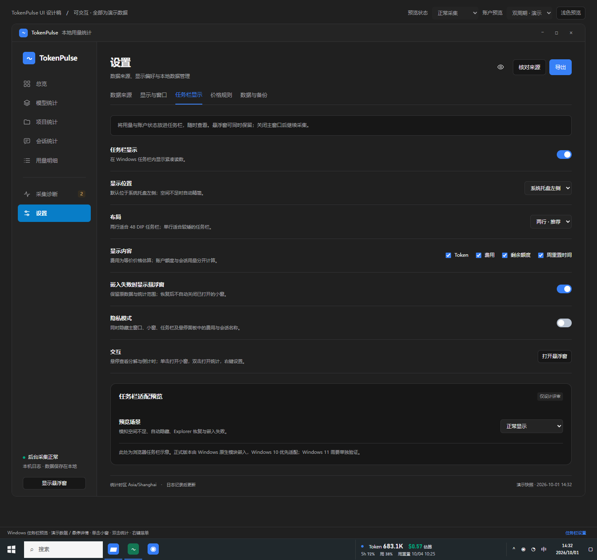

# Windows 任务栏显示模式

2026-10-06 M13g14 背景取色修正：正式 0.1.4 的白底已实际复现，旧 ReBar (0,1) 落在 Windows `DynamicContent1` 天气组件而非空白任务栏。源码改为读取已验证任务列表中、所有 UIA 直接控件之后的空白像素；列表身份 / 完整几何前后校验，空间不足或取色失败保持明确失败。真实自动隐藏仅在存活有效租约和已确认 palette 下保留颜色，重新显示再采样；不以默认深色伪造成功。两位置共用只读控件几何探针；新的 2 项独立预期及 taskbar 71 项自动检查 / strict Clippy 通过，正式安装尚未含本修正。“不截图时消失”仍单独复测，不能从白底原因推断已修复。背景像素的坐标及无效返回按 Microsoft [GetDCEx](https://learn.microsoft.com/en-us/windows/win32/api/winuser/nf-winuser-getdcex) / [GetPixel](https://learn.microsoft.com/en-us/windows/win32/api/wingdi/nf-wingdi-getpixel) 文档核实（2026-10-06），实际证据见[交付记录](../development/delivery-status.md)。

M13g13 补齐 application_right 的真实 S3 验收，与 notification_left 独立运行。主 / 小窗隐藏、固定同一合成会话及 3→10 正式补扫，恢复后新原生快照 / 详情与设置位置保持，原 Explorer 和退出完整任务区 Exact 已在 Win10 19045 / 150% 通过。仅 debug 验收入口增加显式位置参数与位置证明，生产电源路由、布局规则和当前签名宿主保持原实现。证据使用同包 release 宿主 + debug 桌面，不代替正式安装版物理输入 / 全包验收，见[范围与实际证据](../development/delivery-status.md#m13g13应用图标右侧的真实-s3-恢复链)。

M13g12 补充电源生命周期验收：主 HWND 的正式电源路由使 actor 暂停动作与发布，观察到暂停后正常关闭宿主；恢复后重新读取配置 / 真实本地 DTO，可建立新宿主代次，丢弃旧详情与动作意图，不误开主 / 小窗。M16v 同包 release 宿主 + debug 桌面的真实 S3 链及恢复后的 3→10 原生读数、详情关闭、正常退出完整任务区通过。睡眠后系统通知区边界可以变化，验收必须核对同一 Explorer 与完整当前几何；不能将旧通知区坐标当成恢复写入目标。新边界验收仅允许严格共用边界变化，实际最终命中 Exact，捕获的边界变化与失败历史分别记录。正式写入规则没有在这组 debug 验收中改变，见[证据与范围](../development/delivery-status.md#m13g12任务栏宿主的真实-s3-恢复链)。

M13g11 将挂接状态与系统祖先可见性分开：只有真实完全底部自动隐藏、租约 / 归属 / 拓扑仍有效且自有读数 WS_VISIBLE 保持时，允许 Embedded 而实际 readout_visible=false；自身隐藏、未证明的根隐藏仍不可用。在该严格证明下按系统子控件自身可见样式探测结构，防止隐藏祖先导致结构丢失；隐藏期间有效租约在系统刷新时清交互并更新主题 / 数据，其他变化仍脱离重查。实际失败样式、独立 Win32 测试与两位置 release / 完整应用证据见[M13g11](../development/delivery-status.md#m13g11系统自动隐藏与读数自身可见性的区分)。

M13g10 补充通知图标加载后的正常释放规则：仅存活租约持有已验证完整原拓扑、同一 Shell 内核 / 窗口类 / owner / Reserved 阶段，当前任务区精确等于自有 expected、根与左侧 / 垂直几何及 DPI 未变，而且变化仅限 ReBar / 通知区共用边界时，恢复任务区到当前 ReBar 客户端宽度。先验证完整候选、safe_slot 和同帧拓扑，写入后再核对；不移动通知区或写回旧 ReBar，其他外部变化拒绝。终止 guardian 缺少拓扑证明，原严格尺寸规则保留。完整 Tauri 实际捕获 1722→1578 的对应形态并通过恢复 / 隐私 / 禁用 / 再启用，见[根因、保护与证据](../development/delivery-status.md#m13g10通知区边界变化后的有条件预留释放)。

M13g7 补充底部自动隐藏刷新规则：完整任务栏真实移出对应显示器且系统自动隐藏已开启时，已验证租约暂缓 off-screen 按钮测量；恢复可见后立即沿用普通严格 UIA 测量。Explorer 重绘恢复完整原始任务区时，仅同一内核代次 / 读数 / 所有权、同尺寸 / DPI 且精确 original 几何可重预留 expected；未知或外部变化仍隐藏 / 脱离。两位置实际隐藏 / 新快照 / 显示恢复证据见[交付记录](../development/delivery-status.md#m13g7两位置自动隐藏后的实际数据刷新)。

当前原生生命周期实现已按 M13g5 / M13g6 修订：真实 Explorer 正常重启丢弃旧画布 / 租约，重新校验内核进程与完整窗口类代次；隐藏绘图 DC 的有效空裁剪区域正常跳过，不误报绘制失败。已附着租约允许任务栏、ReBar、通知区和读数整体同尺寸 / DPI 平移，仍逐项检查内部预留与系统控件；构造挂接时保持严格坐标门禁，没有有效租约的重试重新读取当前拓扑。实际系统恢复与自动隐藏证据、尚未完成的物理矩阵见[交付记录](../development/delivery-status.md#m13g6真实系统自动隐藏与布局平移恢复)。Windows 11 已由后续用户更正取消，历史 Win11 待办不作为本次交付门槛。

2026-10-03 用户更正交付范围：继续验证 Windows 10，Windows 11 原生适配和验收取消；下方历史 Win11 计划不再作为本次待办。多屏 / 主屏切换 / 断屏、四档 DPI、实际输入及 Explorer 生命周期在 Windows 10 上继续验收，不能用合成检查替代。

M13e7 已补通知区左侧的真实宿主输入证据：独立前台测试窗口 / 失活计数、实际 300 ms 悬停详情与普通刷新不抢焦点、真实单击只小窗动作 / 双击只统计动作、配置 / 隐私意图清除及退出原几何恢复，Win10 19045 / 150% DPI 退出 0。显式点击会打开并聚焦应用表面，被动更新 / 悬停才要求维持原焦点；两项分开验收。此开发场景未把真实输入贯通正式 Tauri 开窗，其他位置物理输入、右键 / 键盘 / 辅助功能、Explorer / Win11 / 物理兼容矩阵继续保留；详见[交付记录](../development/delivery-status.md#m13e7真实任务栏悬停与点击的独立前台验收)。

实施入口：[详细开发设计](development-design.md)，宿主帧协议、隐私与命令权限见 [IPC 契约](ipc-contracts.md)。

M13f1 已通过现有真实账户的正式第三入口：正常冷启动配置、主端 DTO 到独立宿主的可见读数 / 详情全文、三入口共享隐私、隐藏 main / mini 后任务栏维持普通后台新读取、停用几何恢复及宿主退出。验收只比对本次自有窗口，不保存账户数值；入口焦点是自有消息，不能替代物理输入 / GDI 像素 / Explorer / Win11 / 多屏。实际记录及剩余条件见[账户第三入口验证](../development/account-quota-verification.md)。

本设计补充[完整设计方案](token-pulse-design.md)、[UI 设计](token-pulse-ui.md)和[账户额度设计](account-quota.md)。新增类似 TrafficMonitor 的任务栏内显示模式，与统计主窗口、桌面悬浮窗共享后台快照。任务栏与悬浮窗可独立开启，也可同时显示。

当前已实现 M13a–M13e6 的受限协议、独立原生宿主、安全预留 / 实际 Win10 嵌入、归属恢复监督、精确绘制、持久配置、后台管理器、真实设置 / 状态、小窗回退、单击 / 双击、原生菜单和只读详情。两种位置均已接通：通知区左侧，以及测量实际按钮后的应用图标右侧；后者在按钮增减时安全重排。默认不启用任务栏，Win10 19045 / 150% DPI 有实际系统验证；真实输入 / 焦点 / 屏幕阅读器、完整 Explorer 重建、实际拥挤 / 自动隐藏、Win11 与物理兼容矩阵仍待验收。详见[原生宿主协议](taskbar-host-protocol.md)及[交付记录](../development/delivery-status.md)。[HTML 交互原型](../../prototypes/token-pulse-ui.html)底部的任务栏区域全部为演示数据，生产应用通过真实 DTO 显示。

## 1. 目标与入口

用户在其他应用中工作时，可以从任务栏直接看到今日 Token、估算费用和当前账户额度，无需让独立悬浮窗长期占据桌面。

- 设置新增“任务栏显示”页签；托盘与任务栏右键菜单均提供设置入口。
- 默认位置为系统托盘左侧，可选应用图标右侧；仅在适配器能提供安全位置时使用。
- 正式应用首次启动默认保留现有悬浮窗行为，由用户开启任务栏模式。评审原型默认开启，便于直接查看设计。
- 隐藏任一显示区域不停止采集；明确退出应用才停止后台与原生显示宿主。
- 用户无需安装 TrafficMonitor；本工具自行实现显示宿主。

## 2. 常驻内容与视觉

默认两行，横向任务栏内目标尺寸约 360 × 48 DIP。宽度根据实际字体测量、所选项目及可用空间计算，不能仅按固定像素预留。文字直接融入任务栏背景，不使用悬浮卡片外框或大数字布局。

```text
Token 683.1K    $0.57 估算
5h 72%    周 38%    周重置 10/04 10:25
```

这里的美元数值为已计价部分的等价价格估算。账户百分比均表示剩余比例。任务栏顶部用蓝色小点表示当前显示实例；费用用绿色，额度偏低使用琥珀色并保留数值文字。

|显示项目|常驻区域|悬停详情|
|---|---|---|
|可信 Token|缩写总量|完整整数、输入、缓存、输出、统计范围|
|估算费用|绿色金额及“估算”|已计价部分金额、覆盖率、未计价 Token|
|短周期额度|实际周期长度及剩余百分比|剩余条、完整周期名称、重置时间|
|周额度|“周”及剩余百分比|剩余条、重置时间、倒计时|
|周重置|月日及时间|配置时区、绝对时间与相对倒计时|
|更新状态|空间允许时加“旧快照”等短标记|本地用量与账户额度各自的更新时间及失败状态|

任务栏跟随所在系统任务栏的明暗背景，使用系统字体、等宽数字与对比度足够的文字；悬停面板和打开的小窗沿用应用主题。高对比度模式使用系统颜色，保留全部文字状态。

支持单行布局，适合较矮的横向任务栏；可分别勾选 Token、费用、剩余额度、周重置时间，至少保留一项。隐私模式以 `••••` 替代任务栏费用，同时屏蔽悬停详情中的费用与会话名称，避免工具提示或可访问名称泄露。

## 3. 空间不足规则

优先保住 Windows 的应用按钮、系统托盘和时钟。适配器先计算可用矩形，再决定展示密度；测量不足时不能直接覆盖已有系统元素。

1. 正常空间：显示所选项目，优先两行。
2. 紧张空间：取消费用辅助文字，隐藏常驻周重置时间和短周期额度；保持 Token、费用、周剩余，完整内容放到悬停面板。
3. 更窄空间：按用户选择项目的优先级逐项精简；仍无法容纳一个可读项目时停止嵌入，按回退偏好显示悬浮窗。

原型“空间不足”模拟约 198 DIP 宽的两行精简模式。竖向任务栏、系统小按钮模式和不同字体放大比例需要分别测量；未验证的形态直接使用回退，不强行使用横向模板。

## 4. 鼠标与键盘交互

|动作|结果|
|---|---|
|悬停约 300 ms|在任务栏上方显示只读详情面板；不抢焦点|
|离开 / Escape|隐藏悬停面板|
|单击 / Enter / Space|在任务栏附近打开展开悬浮窗，保持当前统计范围|
|双击|打开统计主窗口；固定会话时定位该会话|
|右键 / Shift+F10 / 菜单键|打开菜单：悬浮窗、统计、任务栏设置、隐私模式、隐藏任务栏显示|
|菜单方向键 / Home / End|移动焦点；Escape 关闭并返回任务栏入口|

原生实现按系统 `GetDoubleClickTime` 延迟确认单击，双击到达后取消待处理单击，避免两种动作连续触发。原型采用 240 ms 演示延迟。自动数据刷新保持当前键盘焦点，不自动弹窗。

M13g1：原生画布的 `WM_GETDLGCODE` 只请求当前可用的 Enter / Space / 菜单键 / Shift+F10；方向 / 翻页 / 首尾 / Escape 只在详情可见时请求。Tab、普通字符及无按键的通用查询交给 Windows，避免无条件 WANTALLKEYS 阻止原生焦点导航。Win10 自有窗口的实际 IsDialogMessage / 焦点 API 已验证 Tab 移出、再进入、详情随失焦关闭且无动作、Enter 仅一次打开小窗动作；不当作 Explorer 物理键盘或屏幕阅读器完成证据。依据 [WM_GETDLGCODE](https://learn.microsoft.com/zh-cn/windows/desktop/dlgbox/wm-getdlgcode) 和 [IsDialogMessage](https://learn.microsoft.com/en-us/windows/win32/api/winuser/nf-winuser-isdialogmessagew)，已经由 IsDialogMessage 处理的消息不再额外分发。

M13g2：真实独立宿主的 UI Automation 名称 / IsKeyboardFocusable 和五个标准菜单项名称 / Invoke 模式已经以固定合成夹具独立验证。共享隐私 ACK 前清空真实 provider 名称并关闭菜单，新快照不含旧私有字段；查询使用不拥有窗口的 MTA、固定超时和自有 PID / 类验证，不调用 Invoke / SetFocus 或 SendInput。属性检查不等于实际 Narrator 朗读或 Explorer 物理键盘导航，详见[交付记录](../development/delivery-status.md#m13g2真实-ui-automation-名称与原生菜单模式)。

悬停面板宽约 340 DIP，按当前屏幕工作区夹紧位置；点击打开的小窗为现有 360 × 380 DIP 展开模式。悬浮窗继续支持固定会话、拖动、收起和隐藏。任务栏不提供鼠标穿透，因为读数本身就是交互入口。

## 5. 统计范围与异常状态

任务栏与悬浮窗共用 `mini_scope`：全部来源的今日用量，或固定会话的今日用量。主窗口的筛选不自动修改常驻显示范围。固定会话改变 Token 与费用，账户额度始终取当前选定账户及额度桶。

|状态|显示规则|
|---|---|
|今日确实无用量|Token 为 0，费用为 $0.00|
|未配置来源|Token 与费用为 `—`；入口引导添加来源|
|全部用量未计价|费用显示“未计价”，Token 正常显示|
|部分未计价|保留已计价金额，悬停显示价格覆盖与缺口|
|本地来源更新失败|保留上次可信统计，详情标记来源待恢复及最后更新时间|
|账户未连接|“额度未连接”，周重置为 `—`，不伪装为 0%|
|额度窗口缺失|对应项 `—`，详情显示“未提供”；不推断周期|
|额度更新失败|保留旧百分比并标记“旧快照”；详情解释失败|
|重置时间已到|“周重置待更新”，请求新快照；不自行改为 100%|
|Explorer 正在恢复|保留后台快照，等待重新定位任务栏宿主|
|任务栏嵌入失败|任务栏状态转为不可用；保留托盘入口并按偏好打开悬浮窗|

详细账户字段、桶隔离及倒计时规则见[账户额度设计](account-quota.md)。本地用量和账户额度有独立修订号及更新时间，不能因一项成功刷新而把另一项也标为最新。

## 6. Windows 原生接入决策

采用轻量 Win32 绘制窗口作为任务栏子窗口，参考 TrafficMonitor 的嵌入思路。TrafficMonitor 作者说明其任务栏模式使用子窗口嵌入，这为本方案提供可行性依据；这仍需要 TokenPulse 自身适配与测试。[TrafficMonitor 任务栏说明](https://github.com/zhongyang219/TrafficMonitor/wiki/Taskbar-Window)

任务栏内部窗口结构不是稳定的公共扩展契约。因此用 `WindowsTaskbarAdapter` 隔离系统版本、宿主识别、可用矩形计算和布局行为；不把识别规则散落在业务或前端中。Windows 10 22H2 / 19045 为首个验收目标。Windows 11 的任务栏结构与拥挤时布局需要单独验证，未知系统版本不宣称支持；作者也记录了 Windows 11 图标拥挤导致的重叠问题。[TrafficMonitor 作者常见问题](https://github.com/zhongyang219/TrafficMonitor/blob/master/Help_en-us.md)

建议独立原生显示宿主进程，用 Rust `windows` 绑定创建窗口，以 DirectWrite / Direct2D 或等效系统绘制接口渲染文字。主 Tauri 窗口与悬浮窗继续使用现有 WebView；不直接将现有 WebView 跨进程挂入 Explorer。该选择用于隔离 DPI 与宿主生命周期影响：Microsoft 文档说明 `SetParent` 不自动调整 `WS_CHILD` / `WS_POPUP`，不同 DPI 感知上下文的跨进程挂接还可能重置子窗口进程的 DPI 感知状态。[Microsoft SetParent 文档](https://learn.microsoft.com/en-us/windows/win32/api/winuser/nf-winuser-setparent)

集成限制：

- 不注入 DLL，不在 Explorer 内加载统计或 WebView 代码，不替换系统任务栏。
- 标准用户权限运行；无须通过管理员权限修复一般的布局问题。
- 托盘使用已有独立实现，不能因为任务栏宿主失败而失去恢复入口。
- 适配器对必要的布局调整记录所有权、原矩形与当前值，只撤销本实例仍持有的调整；无法安全预留空间就拒绝嵌入。
- Explorer 重建后丢弃旧 HWND 和旧布局记录，重新探测；不能向失效或复用的 HWND 写入恢复值。
- 不以屏幕底部的置顶覆盖窗冒充嵌入成功；回退明确使用已有悬浮窗。
- 不使用 DeskBand / COM Shell 扩展作为首版交付路径，避免引入 Explorer 内加载与注册流程。

## 7. 模块与数据协议

|模块|职责|
|---|---|
|`MiniDisplayController`|管理任务栏与悬浮窗共享范围、隐私、格式化偏好及快照|
|`TaskbarHostManager`|启动 / 停止原生宿主、监测断连、有限重试、上报能力状态|
|`WindowsTaskbarAdapter`|识别支持的任务栏、测量可用空间、挂接 / 脱离、系统事件处理|
|`TaskbarRenderer`|原生字体测量、常驻读数、悬停面板、命中测试、可访问性|
|Tauri 前端|设置、统计主窗口、悬浮窗与用户操作反馈|

主进程通过仅限当前用户的本地 IPC 通道发送最小展示快照，宿主不得读取 JSONL、SQLite 或账户凭据。协议带版本与宿主实例标识：

```text
TaskbarSnapshot
  protocol_version, instance_id
  usage_revision, usage_observed_at, mini_scope
  total_tokens_decimal, input_tokens_decimal, cached_tokens_decimal
  output_tokens_decimal, estimated_cost_decimal, currency, pricing_coverage
  usage_status, unpriced_tokens_decimal
  quota_revision, quota_observed_at, quota_status, selected_limit_id, windows[]
  privacy, theme, locale, timezone, display_preferences
```

Token 以十进制字符串传输；金额采用十进制定点表示。隐私开启时宿主收到的费用和敏感名称应已被移除或替代。窗口动作使用受限枚举 `open_float`、`open_stats`、`open_taskbar_settings`、`set_privacy`、`disable_taskbar`，不允许宿主传入任意路径或执行命令。

设置接口建议 `get_taskbar_status`、`set_taskbar_preferences`、`retry_taskbar_embed`；通知 `taskbar_status_changed` 区分用户启用偏好与实际嵌入状态。配置保存显示项目、位置、布局、目标显示器、失败回退偏好；HWND、物理像素矩形及失败退避状态不作为稳定配置保存。

## 8. 生命周期与系统适配

```text
disabled → probing → embedded
               ↓          ↓ 宿主失效 / Explorer 重建
            unavailable ← recovering → probing
               ↓
        floating fallback（按偏好）
```

- **Explorer 重启**：常驻的顶层控制窗口注册 `TaskbarCreated`；收到消息后重新建立托盘，并令适配器重新探测任务栏。Microsoft 将该广播定义为任务栏重新创建通知；本项目用它触发自身嵌入恢复，是设计推论。[Microsoft 任务栏创建通知](https://learn.microsoft.com/en-us/windows/win32/shell/taskbar#taskbar-creation-notification)
- **挂接失败**：使用有限退避，例如 0.5 / 1 / 2 / 5 / 10 秒尝试；仍失败则进入不可用状态，保留手动重试。重试不得忙循环或重复打开悬浮窗。
- **恢复成功**：任务栏恢复显示；保留用户已打开的小窗，由用户自行隐藏。数据更新不抢焦点。
- **自动隐藏**：读取系统状态，子窗口跟随父任务栏隐藏，不阻止系统收起；悬停详情及时关闭。任务栏状态和矩形可通过系统文档中的 `ABM_GETSTATE`、`ABM_GETTASKBARPOS` 查询，不修改用户自动隐藏设置。[Microsoft 任务栏显示选项](https://learn.microsoft.com/en-us/windows/win32/shell/taskbar#taskbar-display-options)
- **多显示器**：首版在主显示器任务栏上显示一个实例。副屏位置仅在对应任务栏适配完成后开放；显示器移除时返回主屏或回退小窗。定位悬浮窗使用该屏工作区，避免移入屏幕外。
- **缩放与字体**：按宿主所在屏幕重新测量 DIP / 物理像素、任务栏高度及系统字体，覆盖 100% / 125% / 150% / 200% 和跨屏切换。不能假定 `SetParent` 后仍按原 DPI 环境绘制。
- **主题 / 布局变化**：处理主题、系统设置和屏幕变化通知，重新测量后再绘制，避免持续闪烁或一秒一次重挂接。
- **休眠恢复**：重新校验宿主位置与句柄，刷新账户快照；本地采集恢复与任务栏恢复独立处理。
- **退出 / 禁用**：取消计时器，关闭悬停面板，安全脱离并销毁自有窗口；清理本实例仍拥有的布局调整。后台异常终止后的恢复需在原生实现中验证。

## 9. 原型覆盖与正式验收

原型提供两行 / 单行、两种位置、四项内容选择、只读悬停详情、单击小窗、双击统计、右键菜单、隐私联动，以及正常、拥挤、自动隐藏、Explorer 恢复、嵌入失败五种场景。失败回退与重试均为模拟，不会修改本机任务栏或重启 Explorer。

正式版本需通过以下验收后，才能在该系统版本启用嵌入能力：

- Windows 10 22H2 实际挂接与安全脱离，系统按钮、通知区、时钟可正常点击且不重叠。
- 任务栏宽度不足、应用图标增减、开始菜单与系统弹出面板打开时，正确精简或回退。
- Explorer 重启、任务栏重建、宿主崩溃、主进程退出与禁用，均能恢复系统布局或安全停止显示。
- 自动隐藏、锁屏解锁、休眠恢复、主屏切换和显示器拔插不留下孤立窗口。
- 不同缩放、系统字体放大、单行小按钮、高对比度与主题切换保持可读；未知竖向或系统形态按规则回退。
- 双击不同时打开小窗，详情不抢焦点，菜单支持键盘和屏幕阅读器；隐私在所有显示入口生效。
- 与悬浮窗的数据修订、统计范围、未计价、缺失额度及重置待更新状态一致。
- Windows 11 按实际版本单独验收，不能用 Windows 10 的结果替代。


[查看任务栏与主窗口完整预览](../images/token-pulse-taskbar-hover.png)



## 10. 当前原生实现进度（M13d3）

Windows 10 build 19045 已实现实际字体测量、明暗 / 高对比度颜色、任务栏边缘背景取色、受控布局互斥与窗口代际归属。缩小任务按钮区并复核子列表重排后，读数作为真正 WS_CHILD 挂入系统任务栏根窗口；只在预留空间内显示，不覆盖通知区。一般更新保持预留位置，禁用 / 正常退出有条件恢复；系统已改变的布局保留，不强行写回旧矩形。实现细节与范围见[原生宿主协议及布局租约](taskbar-host-protocol.md#m13c2线程所有的布局租约)。

本机 Win10 19045、实际 150% DPI 的独立开发程序已验证显示、隐私更新、显式禁用、重新挂接和正常析构恢复，检查自身读数的实际像素。合成消费 / 价格 / 额度均明确标记开发夹具，不代表真实账户验收；系统按钮实际单击、开始菜单 / 自动隐藏、Explorer 重建、宿主强制终止 / 主端清理、Win11 与完整物理多屏 / DPI 矩阵尚未通过。生产管道默认不启用挂接，下一模块完成跨进程归属清理 / 配置状态后，再接主端管理器、原生鼠标 / 悬停 / 菜单、正式三入口与回退。没有执行性能测试。

M13c3a 已补齐父端仍运行时的已结束宿主恢复：完整实例头与有界窗口属性保存几何 / 双方进程创建时间，父端使用自己的 Child 内核句柄确认已结束及身份，才恢复仍匹配的布局。实际 Job 强制终止开发子进程、拒绝错误身份、恢复 / 重复清理和新实例重挂接通过；上述 M13c2 的“宿主强制终止 / 主端清理”待办由此完成这一部分。主进程本身异常退出监督、恢复有界执行与准备阶段歧义仍待收尾，生产管道仍默认隐藏；这不代替 Explorer 重建、交互或其他系统版本的验收。详见[已结束宿主归属设计](taskbar-host-protocol.md#m13c3a已结束宿主的布局归属记录与父端清理)。

M13c3b 已实现主进程异常退出的独立清理监督及 5 秒恢复期限。生产启动器在清理 armed 前不允许宿主运行，清理复用同一原生程序的受限模式、位于宿主 Job 外，并持有经过创建时间 / 程序路径验证的内核句柄。本机实际强制结束开发父进程后原任务栏几何恢复通过，模拟阻塞恢复返回真实超时；没有故意阻塞 Explorer。全套 35 项自动检查通过。上述父进程监督 / 有界执行待办完成这一部分，Prepared 歧义、正式配置 / 状态、交互 / 管理器及兼容矩阵继续落实，生产 wire 默认仍隐藏。详见[隔离清理设计](taskbar-host-protocol.md#m13c3b独立清理监督与期限)。

M13d1 已将显式启用 / 显示偏好和真实状态接入正式宿主管道，较新配置清除旧快照后等待新数据，不把配置确认当作 embedded。本机使用正式独立宿主和合成夹具，实际验证两行显示、单行仅 Token 的较窄空间、隐私清屏、禁用恢复及焦点保持；37 项自动检查通过。普通 Tauri 应用仍默认禁用，管理器、实际设置 / DTO、原生交互与回退下一步接入。详见[配置与状态](taskbar-host-protocol.md#m13d1正式启用配置与实际状态)。

M13d2 / M13d3 已补齐持久偏好、一致 SQLite 输入和 Tauri 后台所有者，正式主窗口命令可启用 / 配置 / 重试并取得真实状态；默认仍关闭。后台使用小窗共享范围及独立账户 DTO，主窗口隐藏继续刷新，隐私事务先等待原生清屏屏障，休眠 / 明确退出关闭自有宿主并记录真实清理结果。本机真实 Tauri、独立宿主及隔离无来源数据库通过启用、隐私、隐藏后继续更新、合成休眠路由、禁用与嵌入时 shutdown 原几何恢复。设置 UI、鼠标 / 悬停 / 菜单、失败回退、应用图标右侧位置和兼容矩阵继续实施；fallback_visible 为 null，尚未实际执行回退。综合原生回归的键盘恢复失败另行复核，不将本步骤说成所有系统验收通过。

M13d4 已提供正式任务栏设置与运行诊断，偏好保存、原生 embedded 状态和未知值分别展示；通知区左侧可配置，应用图标右侧及自动回退当前明确不可用，随后继续实现。前端通过完整状态命令重新查询，不直接显示事件载荷；草稿按精确原修订保存，刷新 / 外部修改不会覆盖。实际 Win10 WebView 设置页显示 embedded，并通过页面保存禁用、恢复原几何。鼠标 / 悬停 / 菜单、自动回退及 Explorer 生命周期仍在保留范围。验证细节见交付记录 M13d4。


M13e1 已落实失败回退：设置启用时由主应用异步显示已有小窗，一段失败仅尝试一次，用户隐藏后不自动重开；显式重试 / 新配置生命周期或嵌入恢复后可开放新请求。自动显示不抢焦点，恢复任务栏或关闭回退保留现有小窗。实际可见性与错误分别显示，回退失败保留未知；不把小窗可见当作 embedded。Win10 19045 / 150% 的无小窗创建、隐藏窗口复用、前台保持和恢复保留已通过，其他原生交互与兼容矩阵待后续。


M13e2a 已实现原生系统双击判定与有界动作拉取，普通刷新保留意图、隐私 / 配置清屏清除意图；主端窗口动作尚待接入。Win10 鼠标整场发现锁屏覆盖 / 前台状态异常，未计为通过，详细区分自动检查与真实系统结果见交付记录。


M13e2b 已接正式主端单击展开 360×380 小窗及双击同范围统计，使用已保存时区和精确范围；已存在 WebView 外部展开会重新读交互状态。窗口操作错误独立显示，隐私 / 生命周期门禁取消迟到操作。Win10 自有窗口消息、正式通信和实际窗口场景通过；真实鼠标 / 焦点保持仍待复核，悬停 / 菜单及兼容范围继续实施。
M13e3 已接入标准 Windows 右键菜单及五种正式受限动作：显示小窗、同范围统计、任务栏页签、三入口共享隐私和持久隐藏任务栏。菜单显示当前隐私勾选，支持菜单键 / Shift+F10 入口和 Enter / Space 小窗意图；原生菜单文字助记键与取消由系统处理。菜单期间配置 / 隐私改变结束菜单并拒绝旧选择，销毁的画布保留资源至模态过程返回。隐私 / 隐藏经过发布清屏协调器和精确 CAS，不覆盖其他偏好。主窗口统计与设置采用同一保留导航修订，迟到响应或重新显示不会覆盖较新导航。

实际 Win10 菜单结构、五项自有助记字符消息 → 正式 pipe / 后台 → 真实窗口 / SQLite、菜单打开时隐私清屏与 shutdown 原几何恢复通过；这些自有消息不等于真实鼠标 / 方向键 / 焦点 / 屏幕阅读器验收，悬停与兼容矩阵继续实施。标准菜单调用按 [TrackPopupMenuEx](https://learn.microsoft.com/en-us/windows/win32/api/winuser/nf-winuser-trackpopupmenuex) 返回受限命令 ID，清屏在菜单所属线程调用 [EndMenu](https://learn.microsoft.com/en-us/windows/win32/api/winuser/nf-winuser-endmenu)。

M13e4a 已补悬停详情数据和平台无关格式化，尚未创建可见原生面板。正式快照提供应用主题、精确半开范围、分项完整性、独立来源成功核对 / 用量快照 / 账户成功及尝试时间；受限来源状态不包含原始路径或诊断原文。详情保留完整整数和精确金额，未知 / 部分分项明确标记，价格覆盖不经过大整数浮点转换；账户显示所有实际窗口 / 周期、未知 / 零剩余和到期等待更新，不从会话推导账户值。隐私同时覆盖详情与可访问全文。接下来仍须完成 340 DIP 原生绘制、300 ms 悬停、非激活 / 工作区与关闭行为，并独立记录系统验收。

M13e4b 已接真实原生只读详情窗：约 340 DIP、工作区夹紧 / 最多 600 DIP 高、按系统字体完整换行、滚轮和入口方向 / 翻页 / 首尾键浏览。应用主题与系统高对比度生效；剩余条仅用服务实际值，未知与 0% 分开。入口注册 300 ms 悬停，非激活显示；Escape、点击 / 菜单、失焦、来源移动 / 隐藏、禁用和销毁关闭。普通更新不自动打开隐藏面板，隐私屏障丢弃文本帧 / 窗口名称并覆盖旧像素后才确认。Win10 19045 / 150% 正式双进程显示、工作区、两次隐私切换和菜单 / 窗口 / 几何恢复回归通过；自有消息与原生位图不替代真实悬停时序、键盘可达性 / 焦点、屏幕阅读器、自动隐藏和物理 DPI / Win11 验收。

M13e5a 补齐已销毁读数代次后的恢复：丢弃旧布局 / 画布 / 详情 / 意图，重新探测任务栏和测量后创建新类并安全挂接当前快照。Win10 正式双进程在详情 / 待确认单击和菜单打开时分别丢失自有嵌入子窗口，同一宿主新建窗口恢复，旧动作不漏出，退出原几何恢复通过。这里没有重启 Explorer；完整 Shell 生命周期 / 结构变化、实际输入与多屏 DPI 仍需验收。

M13e6 已开放正式应用图标右侧位置：只读验证实际按钮矩形，保留 8 DIP 间距和至少 320 DIP 应用区域，预留后再核对；按钮增减先恢复旧租约 / 清除旧交互再安全重排。未知 / 隐藏 / 越界 / 超时拒绝，空间不足按实测精简或回退。Win10 19045 / 150% 真实设置保存、自有独立按钮增减 / 两位置切换及菜单 / 窗口 / 隐私 / 退出恢复通过。此结果不替代物理输入、实际拥挤 / 自动隐藏、完整 Explorer / Win11 / 多屏 DPI。较早模块的“应用侧不可用”是当时状态，以本增量为准。
