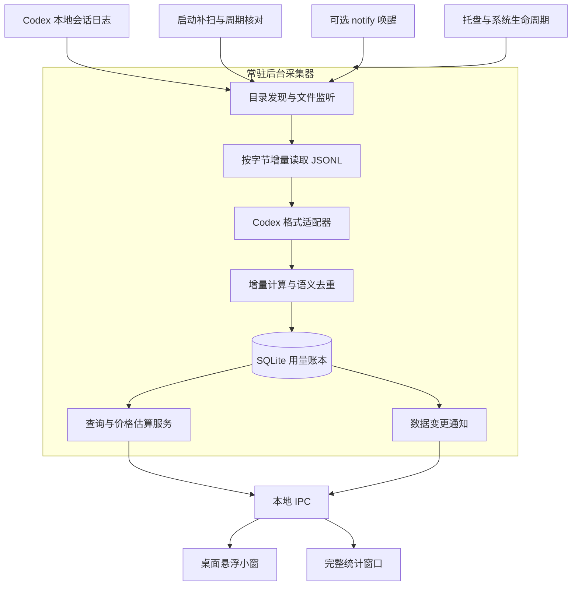

# Codex 用量统计桌面工具完整设计方案

剩余功能的最终选择见[实施计划第 7 节](../development/implementation-plan.md#7-已确认的剩余功能范围2026-10-02)，优先于本方案的旧范围描述。诊断采用简化版，安装打包采用简单版；自动更新、notify、完整离线价格 / 别名、后台费用重估与 Windows 多屏 / DPI / 任务栏继续实施。

本方案用于在独立新项目中开发一个本机 Codex 用量统计应用，包含桌面悬浮小窗、完整统计窗口和常驻后台采集器。应用通过读取已配置的 Codex 会话日志获得用量，不依赖 IDEA、当前插件、全局 Node.js 或 TokenTracker CLI。

采用 Tauri 2、Rust、TypeScript 前端与 SQLite。后台采集器负责数据发现、监听、增量读取、用量计算、持久化和查询；两个窗口通过本地 IPC 使用同一份数据。关闭窗口不终止采集，明确退出应用才停止进程。历史日志可以在重新启动时补采集。

参考代码固定位置为 `E:/Documents/Code/jetbrains-cc-gui`；TokenTracker 核心统计代码位于 `C:/Users/Amin/.tokentracker/tracker/app`。复制本文件至其他项目后，仍从这些绝对位置读取参考代码，开发内容写入新项目。[第 23 节源码定位](#23-参考资料与源码定位)列出所有完整文件路径、定位锚点及跨目录读取命令。

本文给出完整产品行为、模块接口、数据模型、准确性规则、窗口交互、异常恢复、打包部署和验收条件。各章节按当前有效范围交付。2026-10-02 用户取消 M14：统计导出、手动备份、备份恢复、跨设备离线恢复及应用内数据清除不纳入实施；F10 与 A13 保留编号并停用，迁移保护和专门故障恢复不再追加开发或专项验收；既有内部机制保持现状，基本统计正确性与原始日志只读仍有效。

### 核心设计决策

|决策|实现要求|
|---|---|
|采集方式|文件监听负责及时发现，周期核对和启动补扫负责补漏；notify 是可选唤醒来源。|
|统计依据|采用日志中的用量数值；保存来源与计算依据，未知数据不显示为零。|
|数据存储|SQLite 保存用量观察和派生事件；偏移、基线、事件在一个事务中提交。|
|窗口关系|悬浮窗和统计窗口共享采集器、数据库和查询服务。|
|实时边界|承诺日志落盘后的处理延迟；不承诺尚未写入日志的逐 Token 计数。|
|成本含义|美元数值为模型价格估算，与订阅实付和剩余额度分别表达。|

### 使用范围

支持已配置的 Windows 本地目录与自定义 Codex Home，交付 Windows 10 / 11；macOS、WSL / 网络来源适配已取消。已同步到本地的合法日志按普通本地来源处理，不提供远程同步功能。账户额度和登录管理不属于本工具的用量采集职责。

设计日期 2026 年 10 月 1 日

## 文档导航

本文可以直接作为新项目的需求与技术设计输入。实现约束使用“必须”，默认设计参数使用“默认”，需通过测试确定的性能要求使用“目标”。文中的设计参数并非现有代码已实现的能力。

- [1 现有实现依据与独立项目边界](#1-现有实现依据与独立项目边界)
- [2 产品功能与统计范围](#2-产品功能与统计范围)
- [3 系统架构与模块职责](#3-系统架构与模块职责)
- [4 数据源发现与覆盖策略](#4-数据源发现与覆盖策略)
- [5 监听调度与实时更新](#5-监听调度与实时更新)
- [6 JSONL 增量读取与检查点](#6-jsonl-增量读取与检查点)
- [7 Token 口径与上下文快照](#7-token-口径与上下文快照)
- [8 用量增量与多计数流处理](#8-用量增量与多计数流处理)
- [9 去重 分叉与重扫纠正](#9-去重-分叉与重扫纠正)
- [10 数据库实体与关系](#10-数据库实体与关系)
- [11 事务一致性与恢复流程](#11-事务一致性与恢复流程)
- [12 统计查询与费用估算](#12-统计查询与费用估算)
- [13 桌面悬浮小窗交互设计](#13-桌面悬浮小窗交互设计)
- [14 完整统计应用页面与状态](#14-完整统计应用页面与状态)
- [15 本地 IPC 与接口契约](#15-本地-ipc-与接口契约)
- [16 应用生命周期与通知集成](#16-应用生命周期与通知集成)
- [17 性能 资源与并发控制](#17-性能-资源与并发控制)
- [18 隐私 安全与数据管理](#18-隐私-安全与数据管理)
- [19 测试矩阵与准确性验证](#19-测试矩阵与准确性验证)
- [20 打包部署 更新与配置迁移](#20-打包部署-更新与配置迁移)
- [21 项目组织与实现约束](#21-项目组织与实现约束)
- [22 完整交付验收标准](#22-完整交付验收标准)
- [23 参考资料与源码定位](#23-参考资料与源码定位)

### 关键术语

|术语|含义|
|---|---|
|源记录|Codex 日志中的一条完整 JSONL 记录。|
|用量观察|原始 token_count 中的本次和累计用量，以及必要的元数据。|
|用量事件|经归一化与去重后计入统计的新增用量。|
|计数流|维护独立累计用量的一组模型调用，不必等同于会话或用户回合。|
|检查点|已提交的字节偏移、读取上下文与增量计算基线。|
|重建|重新解析来源数据并替换受影响的派生统计。|

## 1 现有实现依据与独立项目边界

当前插件的 Usage Statistics 页面加载 TokenTracker Dashboard。Java 的 TokenTrackerHandler 检测或启动本地 CLI 服务，并代理 WebView 请求。页面打开和手动刷新会触发同步，显示层另有周期读取。

本机核查的 tokentracker-cli 与通知脚本内置运行时均为 0.87.3。TokenTracker 读取 Codex 的 sessions 和 archived_sessions，会保存文件偏移、模型及累计基线，并把统计桶快照写入 queue.jsonl。该事实用于分析现有实现，不构成新项目的运行依赖。

|现有机制|在新项目中的处理|
|---|---|
|按偏移读取 JSONL|独立实现，保留字节级增量读取与完整记录提交的原则。|
|last 与 total 联合计算|归入 accounting 模块，保存推断依据与异常状态。|
|缓存输入拆分|使用明确的包含式原始字段，派生非缓存输入。|
|累计值和重扫去重|采用逻辑会话身份、观察记录和事务重建。|
|npm CLI 与 HTTP 服务|采集器编译进桌面应用，内部通信使用 Tauri IPC。|
|Java 和 JCEF 转发|由桌面壳的命令接口与变更事件替代。|
|累计快照队列|以 SQLite 事件明细和可重建查询视图替代。|
|前端定时刷新|提交后通知窗口，窗口重开时查询一致快照。|

TokenTracker 使用 sessionId 加 timestamp 去重，并对分叉回放使用时间间隔启发式；这些规则有边界，不能直接认作唯一事件身份或精确继承识别。其每分钟兜底扫描还取决于特定应用环境变量，新项目将调度条件显式纳入后台生命周期。

现有日志格式属于已观察到的实现格式。官方文档确认 CODEX_HOME 和 notify 能力，但没有在本方案引用的文档中保证本地 rollout JSONL 为永久稳定的统计接口。因此 Codex 解析器必须独立、带格式诊断并支持重建。[S1][S2]

## 2 产品功能与统计范围

### 完整功能要求

|编号|功能|验收行为|
|---|---|---|
|F01|数据源管理|自动发现、手动添加、暂停、移除和检测目录可读性。|
|F02|历史导入|显示扫描与处理进度，支持取消、恢复和重新导入。|
|F03|持续采集|窗口关闭后仍采集；重启与唤醒补扫。|
|F04|悬浮显示|今日汇总、缓存占比、最近用量和采集状态。|
|F05|完整统计|按日期、来源、项目、模型和会话筛选。|
|F06|会话查看|独立显示累计消耗、用户回合和最近上下文快照。|
|F07|价格估算|匹配价格规则、显示未计价用量、支持自定义规则。|
|F08|简化诊断|来源状态、错误原因、必要文件位置和基本重建进度；不做完整任务历史、原文采样或继承证据浏览器。|
|F09|重建与纠正|对指定来源或会话重算，原结果在成功切换前可查询。|
|F10|已取消：导出与备份|对应 M14，不纳入实施与验收；保留编号。|
|F11|系统集成|托盘、单实例、明确退出和可选 notify；不做开机启动与额外全局快捷键。|
|F12|基本维护|既有存储初始化 / 迁移、更新校验及卸载配置处理；不追加迁移保护与专门故障恢复。|

### 数据覆盖说明

范围定义为“该设备上已配置数据源中可读取且可识别的用量记录”。不把本机统计宣称为整个账户统计，不读取认证文件推测账户归属。日志若没有可靠账户标识，账户字段保持未知。

不能仅凭同一模型名确认具体计费产品。中断或失败的任务如果已产生可信用量记录，仍计入；没有记录的消耗保持未知，不伪造零消耗。

项目默认依据事件时刻的 cwd 归属；同一会话改变 cwd 时允许拆分至不同项目。模型以事件附近的有效元数据为准，不把会话最后一个模型回填到整段历史。

## 3 系统架构与模块职责



### 模块边界

桌面壳负责窗口、托盘、已有交互恢复快捷键和系统事件，不提供开机启动。采集器负责变化发现与任务调度；Codex 适配器把日志转换为标准观察；accounting 只执行确定的用量计算规则。storage 负责事务和迁移，query 负责筛选、汇总和价格计算。

悬浮窗与统计窗口仅发送结构化查询和操作命令，不持有文件句柄、累计基线或数据库写连接。后台工作运行于 Rust 异步任务和受限阻塞任务池，不占用窗口交互线程。

保持一个数据库写入者和一个全局调度器。同一逻辑会话串行处理，不同会话可以并行读取，提交按批次串行执行。历史导入和实时任务使用同一套解析与去重规则，实时任务拥有更高调度优先级。

架构提供 ProviderAdapter 接口，使日志格式与统计核心分离。本工具的完整统计对象为 Codex；接口允许新项目按独立需求增加其他来源，不改变已定义的产品范围。

## 4 数据源发现与覆盖策略

### 来源配置

source_id 标识一个经过规范化的数据源，保存 provider、root_path、来源类型、启用状态、可读性和最近扫描时间。默认顺序为用户指定目录、桌面进程可见的 CODEX_HOME、用户目录下的 .codex。官方配置目录由 CODEX_HOME 控制，默认值为 ~/.codex。[S1]

桌面进程不必继承终端环境，所以提供手动目录选择和“重新检测”。对相同物理目录的路径别名、大小写差异、符号链接和重解析点做规范化；无法证明为同一目录时保留来源并显示重叠警告。

同一 Codex 会话出现在多个已配置镜像目录时，按稳定会话身份和观察内容去重。不得单纯以根目录或完整文件路径作为会话唯一身份。会话 ID 冲突或内容分叉进入诊断，不静默合并。

### 文件发现

扫描 sessions 和 archived_sessions 中的 JSONL，包括日期子目录和归档平铺目录。目录本身不存在时保持待发现状态，定期重试。遍历不得跟随目录环；权限失败单独记录，不中止其他来源。

默认先处理近期与变化文件，历史文件按批次补入。保存目录清单签名及文件元数据，避免每次都递归读取所有文件内容。格式判断以记录类型为准，文件名只用于候选过滤。

### WSL 与远程来源

WSL / 网络来源适配已取消，不新增检测发行版、网络目录选择或远程同步入口；既有内部能力不反向拆除，不作为交付承诺。

macOS 适配和发布已取消。Windows 10 / 11、多屏和各种 DPI 兼容继续实施，具体矩阵见开发实施计划。

### 删除与移除

来源日志被删除不自动清除已有统计。移除来源仅停止采集并保留统计，不提供清除本工具保存的来源数据选项；不得删除 Codex 原始日志。

## 5 监听调度与实时更新

### 主路径

采用文件变化监听，将追加、创建、替换和移动事件加入脏文件集合。默认防抖 300 毫秒，连续写入期间最长等待 2 秒后仍执行一次读取。以上是应用设计参数，可在压测后调整。

同一文件已经处理中时只设置 dirty 标记，不开启并发读取；当前读取结束后再次核对。扫描开始记录文件大小上界，读取至该上界后提交，再处理期间发生的新变化，避免无限追赶写入者。

### 补漏路径

|触发|动作|
|---|---|
|应用启动|核对检查点，发现新增与变化文件，恢复未完成导入。|
|活跃来源周期核对|默认 60 秒检查近期目录与活跃文件元数据。|
|历史目录核对|默认 10 分钟核对清单；恢复和手动重建可完整扫描。|
|系统恢复或 watcher 失效|重新建立监听并立即核对来源。|
|notify 唤醒|定位 thread_id 对应候选文件，进入同一调度队列。|
|用户刷新|提交一次立即核对请求，返回任务 ID 和进度。|

watcher 事件只用于提示“可能变化”，文件内容与已提交检查点才是统计依据。出现事件溢出必须触发目录核对。仅对 Windows 本地来源实施监听与核对，单个来源错误不会禁用整个采集器。

### 窗口更新

事务成功后增加 data_revision，推送 usage_changed。默认把 200 至 500 毫秒内的提交合并成一次通知。悬浮窗查询轻量汇总，主窗口按当前筛选重查；隐藏窗口可以停止绘制和查询，后台采集仍持续。

事件只携带数据版本和受影响范围，不逐条广播所有用量。窗口重开、漏掉事件或恢复后重新获取快照。跨午夜和时区修改触发重新查询，即使没有新的 Token 消耗。

## 6 JSONL 增量读取与检查点

### 读取规则

使用字节偏移，不使用字符数或行数代替文件位置。流式解码 UTF-8，处理字符跨读取块的情况。默认读取块 64 KiB；记录缓冲设上限，例如 8 MiB，超限行登记异常并按行边界恢复。

只解析完整终止的 JSONL 行。末尾半行保留在内存中，持久检查点停在上一条完整记录结束处。应用重启后重新读取半行，不需持久化聊天正文。空行跳过；完整但损坏的行记录偏移与错误类别后继续。

维护文件身份、出生或创建时间、已提交大小、mtime 与检查点附近内容校验。文件缩短、替换、同尺寸覆盖或已读尾部变化触发重扫。仅 inode 或仅 size 都不足以判断所有覆盖情况。

### 处理流程

```text
取得来源锁和逻辑会话锁
打开文件并获取身份和读取大小上界
验证上次检查点及已读内容锚点
从检查点读取完整 JSONL 行
适配记录并计算本批新增用量
事务提交观察 事件 基线 上下文与字节偏移
释放锁并核对处理期间的新变化
```

### 持久化状态

除偏移外，必须保存有效模型、cwd、回合 ID、父会话关系、累计流基线、格式版本与解析器版本。否则仅从新增字节继续读取时，会丢失前面元数据造成错误归属。

文件路径变化但逻辑会话和内容连续时迁移文件位置。内容已变化时创建新的文件 generation，并重新构建受影响会话。检查点不以路径字符串为唯一依据。

解析器输出使用明确枚举区分可接受观察、无统计意义记录、格式不支持和记录损坏。不得把未知格式静默归为零。诊断仅保存偏移、错误类别与必要元数据，不新增原文采样。

## 7 Token 口径与上下文快照

### 包含关系

保存 Codex 原始字段含义，并在查询时派生展示值。现有 TokenTracker normalizeUsage 从 input 中减去 cached，说明缓存输入已经包含于原始输入；reasoning 也是输出子项。[C4]

|字段|语义|
|---|---|
|input_tokens_total|输入总数，包含 cached_input_tokens。|
|cached_input_tokens|缓存输入子项。|
|output_tokens_total|输出总数，包含 reasoning_output_tokens。|
|reasoning_output_tokens|推理输出子项，不能重复计入总量。|
|cache_write_tokens|来源明确报告的缓存写入信息，按适配器约定解释。|
|total_tokens|来源报告的总用量，保留原值。|

```text
非缓存输入 = input_tokens_total - cached_input_tokens
总量校验 = input_tokens_total + output_tokens_total
展示分解 = 非缓存输入 + 缓存输入 + 输出总数
```

例如输入 100000、缓存 90000、输出 5000、推理 2000，则总量为 105000，非缓存输入为 10000；不能再加上缓存或推理。total 若与可验证分解不一致，保留原值并标记异常，不擅自补造。

### 累计消耗与上下文

total_token_usage 用于增量与会话累计计算，不能当作当前上下文占用。last_token_usage 代表最近一次请求的用量快照，也不自动等于一个用户回合的全部消耗。一个回合可以包含多个模型调用。

上下文面板保存最近可信快照和 model_context_window，以“最近请求上下文”表达；显示快照时间及来源。按 current model context 的可用输入输出口径计算，不重复加入缓存。缺少窗口容量时只显示用量，不编造百分比。[C6]

### 未知与异常

字段缺失、负值、缓存大于输入、推理大于输出、累计重置均保留质量标记。正常化不把未知置零。能验证的子项参与分解，不能验证的项显示未知；上下文率和费用分别注明覆盖程度。

Token 使用 64 位整数；前端通过十进制字符串接收大整数，防止超过 JavaScript 安全整数范围。显示缩写同时支持完整数字提示。

## 8 用量增量与多计数流处理

### 输入与输出

accounting 接收 last_usage、total_usage、日志时间、会话及可用流标识。输出新增用量向量、matched_baseline、calculation_method 和 quality。所有字段按同一流整体比较，不只比较 total_tokens。

### 计算规则

有可靠流 ID 时维护该流的累计基线。没有流 ID 时利用 total - last = 该流前一累计值的关系寻找候选基线。现有 consumeUsageDelta 保存最多 32 个基线处理交错流；新项目采用可配置容量和溢出诊断，不将固定容量当作正确性保证。[C3]

|条件|计入规则|
|---|---|
|total 向量与已知快照相同|视为重复快照，不产生新增计费事件。|
|total - last 唯一匹配基线|计入 last，推进匹配流基线。|
|total - last 可成立但尚无基线|建立流头；计入可信 last，并标记缺少此前连续性。|
|只有 total 且流身份明确连续|按分量计算相邻累计差。|
|只有 last|先执行源记录去重，再计入 last，注明不可验证累计连续性。|
|首次只有 total|保存累计锚点；单独展示无法按时间定位的历史量，不默认算作当次消耗。|
|重置或存在多重匹配|建立新 episode 或隔离为待核对，不强行与任意基线相减。|

累计重置不是负消费，也不是自动退款。保存 episode_id，防止相同累计向量在不同有效计数周期被错误去重。大幅跳变不能直接解释为新增请求，需结合 last、流连续性和源记录判断。

无法证明的累计缺口进入 unattributed_usage，界面显示“存在无法定位的累计用量”。解析修复后可以重分类，但不能无依据把它落到今天或某个模型。

会话或回合失败只影响任务状态，不抹去可信用量。compaction 等元数据变化也不能单独证明计数归零；实际快照和来源语义决定增量处理。

## 9 去重 分叉与重扫纠正

### 分开物理身份与语义身份

物理记录位置由 file_generation 和 byte_offset 标识，用于断点续读。语义事件优先采用来源提供的稳定事件或请求 ID。缺少 ID 时，保存规范化用量载荷、时间、会话、episode 与可用回合信息的指纹，并通过累计流连续性核对。

不能只用 timestamp 去重，也不能把两个数值相同的独立调用视为重复。相同指纹存在多个合理匹配时进入歧义状态；为重扫匹配保留记录顺序和局部锚点。指纹不包括可能被修订的模型名和项目名，元数据纠正更新归属而不产生新消费。

### 分叉历史

会话元数据有 forked_from_id 时保存父会话关系。将子会话前缀与父会话观察序列、累计基线及可用事件 ID 对齐，标记 inherited； inherited 不计入子会话新消耗，但可在历史视图中解释。

父日志不可用或无法确定回放边界时，保留候选观察并标记 uncertain。默认已确认用量与不确定候选分开展示，用户可以查看依据并触发重建。时间密集程度只能作为辅助证据，不能靠固定毫秒阈值承诺精确排除继承历史。

### 重写和归档

移动至 archived_sessions 时按逻辑会话关联，不新建消费。外部工具更改 provider 或模型元数据导致重写时，按新 generation 重新解析，完成对账后替换旧派生结果。

长会话采用 shadow generation：新结果在后台构建，原结果仍可查询；切换活跃 generation 时以短事务提交。不会把重扫结果直接叠加到历史统计桶。

源文件已删除时保留已提交观察与统计。数据库中的必要用量观察允许在原日志缺失后重算算术规则，但缺失的会话元数据与从未采集的记录无法恢复，必须在诊断中明确区分。

### 纠正审计

每次重建记录 reason、旧新解析器版本、旧新事件数、Token 差异与质量变化。日志修订可能让数值下降；界面将其表达为数据纠正，不伪装成负消费事件。

## 10 数据库实体与关系

SQLite 使用 WAL 和受控写入连接，所有时间存 UTC。表通过逻辑 ID 关联；路径是位置属性，不是业务主键。数据库放在应用数据目录，支持迁移前自动备份，不写入 Codex Home。[S5][S6]

|实体|主要字段和职责|
|---|---|
|sources|source_id provider root_path kind enabled readability last_scan；管理目录与来源能力。|
|source_files|file_id source_id canonical_path file_identity generation committed_offset anchors parser_version；维护增量检查点。|
|sessions|session_key provider session_id parent_key created_at last_activity；关联逻辑会话和分叉。|
|observations|observation_id session_key file_id generation offset timestamp raw_last raw_total turn_id stream_hint payload_fingerprint；保存必要用量观察。|
|stream_states|session_key generation episode_id baseline_vector lineage_quality；保存计数流头与依据。|
|usage_events|event_id observation_id session_key active_generation timestamp model project_id turn_id usage_vector method quality；保存计入统计的增量。|
|context_snapshots|session_key timestamp usage_vector model_context_window model quality；与消耗账本分开。|
|projects|project_id canonical_cwd display_name user_alias；项目路径及展示映射。|
|price_rules|rule_id source model effective_from effective_to currency rates origin；保存可追溯价格规则。|
|jobs diagnostics audits|任务进度、异常定位、重建审计；保持运行问题可观察。|

原始快照使用明确可空的数值字段或受校验的 JSON，不能存完整聊天内容。usage_vector 包含输入总数、缓存输入、输出总数、推理输出和来源总量；可空字段保留未知状态。

关键索引为会话及事件时间、事件时间及模型、事件时间及项目、file_id 加 generation 加 offset、session_key 加 payload_fingerprint。有可靠源事件 ID 时设置条件唯一索引；推断指纹不得设置会误吞有效重复调用的简单唯一约束。

汇总缓存只服务查询性能，事件账本是事实依据。维护 active_generation 和 data_revision，任何查询只选择活跃派生结果。来源镜像映射可关联多个文件到同一逻辑会话。

## 11 事务一致性与恢复流程

### 常规提交

```text
BEGIN IMMEDIATE
  插入本批完整观察和经过核对的用量事件
  更新累计基线 模型 项目和最近上下文
  更新文件的 committed_offset 和内容锚点
  更新受影响查询缓存并增加 data_revision
COMMIT
发送 usage_changed 通知
```

数据库事务先提交，界面通知后发送。通知丢失不影响账本；窗口查询 revision 即可恢复。读取失败、解析失败和磁盘满时不推进成功检查点。失败任务保留可定位诊断，按受限退避重试。

### 启动恢复

检查数据库结构和上次作业状态，清理或恢复未激活的 shadow generation。验证文件身份及检查点，重新处理未提交的完整记录；事件身份与基线保证重读不重复增加。

不能依靠内存中“已经读过”的状态恢复。部分 UTF-8、半行和未提交批次统一由已提交字节偏移重读。过期 running 任务转换为 interrupted，再恢复到持久进度。

### 重建

重新解析生成候选 generation，核对观察数量、总量及质量分布后事务切换。新 generation 失败则保持旧结果。重建不删除源文件，不提供清除统计的产品操作。

重建可按来源、会话或解析版本筛选。仅改变价格时重算费用视图，不重新解释 Token。仅修改项目别名时更新展示，不改变事件身份。元数据修订需要更新事件归属并刷新相关汇总。

### 已取消的备份与恢复范围

迁移保护、数据库损坏恢复、自动重建恢复和灾难恢复专项开发 / 验收已取消。既有内部迁移 / 备份实现保持现状，不新增用户备份管理或恢复入口。数据库不可用时显示普通错误，不承诺恢复历史数据。

重建期间界面显示数据状态和任务进度。原日志已缺失而数据库损坏的部分无法保证恢复，应报告缺口，不能呈现为完整历史。

## 12 统计查询与费用估算

### 统一查询口径

筛选使用 UTC 起止时间的左闭右开区间，并携带展示时区、来源、项目、模型和会话条件。当天边界按用户时区生成，支持夏令时，不按固定 24 小时推算每一天。

查询快照携带 data_revision。一个主页面的汇总、趋势和占比必须来自同一读取快照；不能把更新前的总量与更新后的分类放在一起。空白日期补零属于展示行为，未知或未导入日期使用单独状态。

会话数按 distinct session_key，用户回合数按可靠 turn_id，模型调用数按可靠请求 ID。缺少调用 ID 时显示“用量事件数”，不将其标成精确调用数。

模型和项目未知作为独立分类保留。项目改变归属按事件时刻处理。热力图和每日趋势使用同一时区和筛选，周起始日由设置决定。

### 价格规则

每个规则明确模型匹配、来源或自定义 provider、币种、生效时间和输入、缓存输入、输出单价。默认使用可追溯离线价格快照；用户可以手动覆盖，并可主动刷新公开价格。自动匹配采用受控别名，模糊匹配结果要能查看。

```text
估算费用 = 非缓存输入 × 输入单价
         + 缓存输入 × 缓存输入单价
         + 输出总数 × 输出单价
```

单价统一为每百万 Token；缓存写入只有来源含义和对应价格明确时才参与。推理已包含输出，不再次计价。以整数微货币单位或十进制定点计算，禁止浮点误差逐条累计。

未知价格保持 null。页面显示已计价费用、未计价 Token 和价格覆盖率，覆盖率使用本筛选中已计价 total 与可信 total 的比值。价格被修改后保留规则来源和重算时间。

支持“按事件时点价格”和“按当前指定价格”两种明确估算方式。订阅模式仍表达为等价价格估算，不推断账户扣款。查询结果包含价格规则 ID、估算方式和未计价标记。

## 13 桌面悬浮小窗交互设计

### 显示模式

紧凑模式默认约 280 × 160 DIP，显示今日累计、缓存占比、最近更新时间与采集状态；展开模式约 360 × 320 DIP，增加输入输出分解、最近用量和会话选择。尺寸可调整，数字过长时缩写，悬停或点击展示完整值。

支持“全部来源今日用量”和“固定会话用量”两种模式。固定会话明确显示名称及会话消耗起点。最近活跃会话可作为列表排序，不能因多个会话并发而偷偷切换用户选中的会话。

### 操作行为

拖动专用区域移动窗口；点击数字查看分解；点击打开统计主窗口时带上同一筛选。提供置顶、透明度、展开收起、固定会话、隐藏与退出悬浮显示。关闭悬浮窗只隐藏该窗口，采集器仍工作。

提供恢复交互快捷键及托盘菜单。穿透模式必须有可靠解除方式，显示前说明鼠标操作将穿透；配置快捷键冲突时报告错误并保留托盘恢复。工具不抢焦点，不因数据更新自动弹出窗口。

### 多屏和缩放

保存显示器标识、工作区相对位置、DIP 尺寸和缩放状态。显示器断开或分辨率改变时将窗口限制在现有工作区，禁止保存到屏外。跨屏拖动重新计算缩放；重启后恢复至最近有效位置。

支持系统主题、字体缩放和降低动态效果。颜色以文字状态补充，不能仅靠红绿表示正常或异常。数字更新只更新变化区域，动画不得妨碍读数。

### 空白与异常状态

未发现来源显示“选择 Codex 数据目录”；正在导入显示进度；暂不可读显示最近成功数据和时间；不确定用量显示单独提示。已无新的日志事件时显示最后记录时间，不把“没有新消耗”误判为采集失败。

隐私模式隐藏项目路径、会话名称和费用，只保留汇总及状态。可由托盘和界面按钮切换，影响两个窗口，不改变数据采集。

## 14 完整统计应用页面与状态

### 页面结构

|页面|主要内容|
|---|---|
|总览|时间范围、可信总量、未确定用量、输入输出分解、趋势和缓存占比。|
|模型统计|模型用量、占比、价格覆盖、估算费用与未知模型。|
|项目统计|项目排行、按日趋势、归属路径和用户别名。|
|会话统计|会话与父子关系、累计消耗、回合列表、最近上下文快照。|
|用量明细|时间、会话、模型、项目、Token 向量和计算依据。|
|采集诊断|来源状态、扫描时间、错误原因、必要文件位置与基本重建进度。|
|设置|来源、时区、窗口、价格、更新和 notify；不提供开机启动。|

顶部统一筛选支持今天、日期区间和来源、模型、项目、会话。筛选可组合，能恢复默认并显示已启用条件。趋势可切换小时、日或月粒度，查询与分页保持同一快照。

列表按时间或消耗排序，分页和虚拟列表处理大量事件。会话详情不加载完整聊天正文；只显示统计所需信息、回合标识和用量。来源仍可读时提供定位日志按钮，不自动打开敏感内容。

### 全局状态

loading、ready、partial、stale、error 分别对应加载、完整可用、覆盖不全、旧数据和查询失败。刷新期间保留已有数值并显示刷新状态，不能闪成零。全局错误只用于采集器或数据库不可用，单来源错误局部显示。

partial 展示缺少价格、导入未完成、格式不识别或计数歧义的具体原因。error 带可执行操作，例如重试、查看诊断和更换目录。统计为空时区分真实零用量、无日志、筛选无匹配和历史尚未导入。

### 设置持久化

保存窗口配置、筛选、来源、价格和快捷键。settings 带结构版本，写入采用临时文件加原子替换或数据库事务。恢复默认必须区分显示设置与统计数据，不能连带清空账本。

用户能够查看“统计覆盖哪些目录”和“哪些内容不会被采集”。账户额度不混入 Token 图表，价格来源和更新时间在费用详情中可查看。

## 15 本地 IPC 与接口契约

Tauri 命令负责查询和操作，事件负责告知变化。数据库、文件访问与检查点操作只在 Rust 后台执行；窗口只能调用白名单命令。[S3][S4]

|接口|输入和返回|
|---|---|
|get_snapshot|时间区间、时区、维度过滤；返回 revision、总量、覆盖状态和分解。|
|query_series|区间、粒度、过滤；返回按时间分组结果。|
|query_sessions|过滤、排序和游标；返回分页会话统计。|
|query_usage_events|会话或范围、游标；返回分页事件及计算依据。|
|get_context_snapshot|session_key；返回最近可信上下文及容量或未知。|
|manage_sources|添加、暂停、检测、移除；返回来源状态。|
|start_job|核对、导入、重建、价格重估；返回 job_id。|
|get_job 或 cancel_job|job_id；返回进度或请求安全取消。|
|manage_settings 或 price_rules|结构化配置；返回校验结果和生效设置。|

### 通知与一致性

usage_changed 包含 data_revision、affected_session_keys 和可选 UTC 范围；job_progress 包含已完成文件数、发现文件数、当前任务和状态。总数尚未发现完时不显示伪精确百分比。

窗口先订阅事件再请求快照，缓存期间到达的 revision；快照返回后若发现更新版本，再次查询，避免订阅与读取之间丢失变化。重复或乱序通知可丢弃，不能回退到旧快照。窗口卸载时清理订阅。

### 错误和大整数

统一返回 code、message、retryable、source_id 与 job_id。错误包括 SOURCE_UNREADABLE、UNSUPPORTED_FORMAT、AMBIGUOUS_USAGE、DB_WRITE_FAILED、JOB_CANCELLED 和 INVALID_QUERY。用户提示由前端翻译，不解析后台错误字符串来判断逻辑。

Token 和修订号中可能超出安全范围的整数使用十进制字符串传输。路径只在受控命令中使用，禁止通用 shell 执行命令。长任务不阻塞 IPC，取消在完整记录或事务边界执行。

## 16 应用生命周期与通知集成

### 生命周期

启动获得单实例锁，加载配置和数据库，检查结构，再启动调度器与托盘。已有实例收到第二次启动时仅激活指定窗口；同一数据库不得同时运行多个采集写入者。

主窗口关闭和悬浮窗关闭均只处理窗口状态。托盘包含打开统计、显示悬浮窗、隐私模式、采集状态、刷新和退出。退出先停止接收新任务，再完成或取消安全批次、提交检查点、关闭数据库和监听器。

系统休眠前停止新增读取，不等待大型历史导入；恢复后核对来源。开机启动已取消，软件由用户手动启动，以普通用户身份运行。

### notify 可选集成

notify 只把线程 ID 和回合 ID 等必要信息发送给采集器。官方当前支持 agent-turn-complete，通知载荷还可能包含用户消息和助手内容；适配程序必须丢弃正文，不能写入统计库。[S2]

使用同一个应用可执行文件的 headless 子命令，不依赖系统 Node.js。常驻进程可用时，通过带访问控制的本地命名管道或平台本地套接字唤醒；不可用时持久保存唤醒标记，后续启动补扫。通知处理不能阻塞 Codex 等待长时间扫描。

启用集成时先解析用户级 config.toml，保留原有 notify。若需要多通知执行，使用受控链式执行并记录原配置。写入采用 TOML 保真编辑和原子替换，修改后可恢复。卸载仅在当前配置仍匹配本工具时恢复，避免覆盖用户后来的修改。

### 独立运行

工具完全退出时不会持续运行 watcher，Codex 原始日志仍由 Codex 产生。重新启动后按检查点补采集；数据可恢复的前提是日志尚未删除。notify 集成不作为完整统计成立的必要条件。

接入 App Server 的 thread/tokenUsage/updated 可作为专门适配器能力，但不假定它能旁听所有已运行客户端。完整工具默认仍以配置来源日志为观察对象。[S7]

## 17 性能 资源与并发控制

### 工作负载与目标

采用 Windows 11、4 核 CPU、16 GiB 内存、SSD 为基准测试环境。性能目标是验收用设计指标，必须通过实际构建测量，不能当作现有项目的实测结果。

|指标|目标及边界|
|---|---|
|新用量可见延迟|本地完整记录落盘后 P95 不超过 2 秒，含解析、提交和窗口更新。|
|监听漏事件补采集|正常运行下近期来源在一次 60 秒核对周期及处理耗时内恢复。|
|悬浮汇总查询|30 万条用量事件条件下 P95 不超过 150 毫秒。|
|主页面查询|同一规模下 P95 不超过 500 毫秒，超限使用可重建汇总缓存。|
|常驻资源|目标空闲 CPU 低于单核 1%，两个窗口隐藏时私有内存不超过 180 MiB。|
|历史导入|对 1 GiB 日志和 1 万文件记录实际耗时、峰值内存，不阻塞窗口。|

交付范围仅含 Windows 本地来源；性能测试是否执行由用户另行决定。无新日志写入时，不需要每秒读取整个目录。

### 并发与限流

读取并发默认 2 至 4，数据库保持单写入。单批提交按完整记录数和耗时控制，例如不超过 500 条观察或 200 毫秒准备时间；异常大记录不得使批次无限增长。

脏文件队列合并同一路径，多次唤醒不重复扫描。实时变化优先处理，历史任务分片并让出执行资源。每来源拥有退避和错误状态，不以失败重试占满全局队列。

定期核对先比较目录清单和文件元数据，再读取有变化内容；原日志和数据库操作在后台进行。查询按页返回，图表按聚合粒度返回，不把全量事件发送给前端。

### 可观察性

记录扫描耗时、读取字节、观察接受数、去重数、不确定数、提交延迟和查询延迟。运行日志轮转且不含正文或认证信息。资源异常可以定位具体来源、任务和解析器版本。

## 18 隐私 安全与数据管理

### 数据最小化

默认本地统计，不发送日志、用量或项目路径到外部服务，不读取 auth.json，不获取账户登录凭据。模型价格刷新和应用更新是独立网络动作，明确说明所访问的服务；离线时核心统计仍可运行。

解析时允许读取完整行以识别记录，但只持久化 Token 数值、时间、会话关系、模型、项目及必要身份字段。简化诊断不提供原文采样，仅保存错误类别和必要定位元数据。不提供诊断导出或手动清除入口。

SQLite 文件、迁移备份和配置使用当前用户的文件权限。数据库默认不承诺应用级加密；设备加密由系统提供。迁移备份只存于应用数据目录，不提供用户选择备份位置的入口。

### 桌面边界

WebView 加载本地打包资源，使用内容安全策略和最小命令权限。禁用不必要的通用文件、shell 和网络访问接口。外部链接交给系统浏览器并限制允许的协议；路径和查询参数进行类型与边界校验。

监听原日志全程只读。来源路径不能被恢复默认或卸载操作当作输出目录。更新包验证签名；安装或数据库错误显示普通提示，不新增迁移失败恢复流程。

### 数据保留

默认保留用量账本，不因来源暂不可读或停止采集自动删除。设置不提供清除缓存、运行日志、诊断样本、来源统计或全部本工具数据的操作；后台资源回收与卸载数据处理仍须遵守应用数据边界。

M14 已取消，不提供当前筛选结果导出、手动备份或备份恢复。既有内部迁移 / 备份代码保持现状，不再扩展迁移保护或专门故障恢复流程。

### 依赖与授权

新项目独立编写代码，参考现有机制时保留设计出处。记录 Tauri、前端、SQLite 和其他依赖许可证，随安装包提供第三方声明。实际引入外部代码或资源时按其许可证保留相应声明，不能只改名称后移除出处。

## 19 测试矩阵与准确性验证

测试使用脱敏或合成日志夹具，包含不同真实格式变体和文件系统边界。核心算法测试必须验证结果，不只重复实现中的分支。每个解析器调整都执行固定回归夹具。

|案例|必须验证的结果|
|---|---|
|全量与分批导入|任意合法分块后的最终可信事件集合和汇总一致。|
|重复扫描与重启|同一日志多次导入不增加消费；已提交检查点正确恢复。|
|半行与 UTF-8 跨块|半行未计入，补齐后只计一次，中文跨块不损坏。|
|损坏完整行与超长行|定位异常并继续，不永久卡住文件。|
|追加与并发变化|读取期间追加的数据最终被采集，不重复开同文件读任务。|
|缩短 替换 同尺寸覆盖|识别 generation 变化，重建后不叠加旧结果。|
|相同时间不同调用|有效调用均保留，不因时间戳相同漏统计。|
|重复累计与计数重置|重复不新增，重置建立正确 episode。|
|多流交错与基线歧义|唯一匹配正确计算，歧义独立表达。|
|分叉历史与归档移动|继承历史不重复计，移动不新建消费。|
|模型和 cwd 变化|按事件时刻归属，修订元数据不制造新消耗。|
|事务故障注入|提交前崩溃无部分结果；提交后通知丢失可恢复。|
|跨午夜 夏令时 时区切换|日报边界正确，总账本不变。|
|未知字段和未知价格|未知不置零，费用覆盖程度准确。|
|休眠 漏事件 目录不可读|恢复核对补采集，单来源错误不影响其他来源。|
|双窗口与多屏|同 revision 一致，重开不回退，断屏不使悬浮窗失联。|

### 对账与发布检查

将用量事件和原始可信观察逐条对照，并验证分类之和与总量。另用独立简化核算脚本验证已明确单流、无分叉夹具，避免与生产算法共享全部实现。差异必须可解释为未知、继承或纠正。

性能测试记录环境、数据规模、P95 延迟和峰值资源；基本安装 / 卸载检查在隔离用户目录执行，确认不会改写原始 Codex 日志；迁移保护与专门故障恢复专项验收取消。

## 20 打包部署 更新与配置迁移

### 运行与安装

桌面程序打包 Rust 采集器和前端资源，不要求全局 npm 或 Node.js。简单版只交付一个 Windows 安装渠道，安装器检测 WebView2，缺失时给出安装提示；不做多个安装渠道或复杂安装选项。桌面用户目录存放应用数据；程序目录只保存可执行文件和只读资源。[S8]

安装后首次启动检测来源并允许用户修正目录，显示历史导入进度。不提供开机启动；Codex notify 由用户明确启用，安装完成不自动注册。托盘清晰标示应用仍在运行。

### 数据库与解析器迁移

数据库 schema_version、配置结构版本和 parser_version 使用既有机制管理。取消后续迁移保护、备份管理、长回填恢复和迁移失败恢复流程的开发与专项验收；现有已完成迁移代码保持现状。数据库不可用时显示普通错误。

不新增解析器升级后的旧格式自动重解析或复杂自动修复。保留手动重建；源文件追加、替换或改写时所需的重新读取和正确核算仍保留。价格数据更新不触发 Token 账本重算。设置迁移保持来源和窗口位置，并提供校验错误。

### 应用更新

检查更新与下载使用明确发布源和签名验证。安装后沿用既有存储初始化 / 迁移与来源核对。不可用的网络不影响现有统计，更新失败显示普通错误，不新增备份恢复或升级回滚管理流程。

### 卸载与数据保护

卸载提供保留统计数据或清除本工具数据的选择。撤销本工具登记的交互恢复快捷键和 notify 集成；仅当 notify 仍匹配本工具时恢复原配置，不覆盖用户后续编辑。原始 Codex 日志始终保留。

应用内备份恢复及跨设备离线恢复已取消。迁移失败、数据库故障及卸载时仍保留原始日志只读和单实例写入约束。

### 配置项

配置包括 sources、display_timezone、week_start、floating_window、interaction_recovery_hotkey、privacy_mode、retention、price_rules、update_policy 和 notify_integration。扫描参数和调试选项与常用界面设置分别展示，默认值及变化写入可追溯配置。

## 21 项目组织与实现约束

### 独立项目结构

```text
codex-usage-desktop/
  ui/
    floating/       悬浮小窗
    dashboard/      完整统计页面
    shared/         类型 格式化 查询状态
  src-tauri/src/
    app/            窗口 托盘 生命周期
    collector/      发现 监听 调度 读取
    adapters/codex/ 日志格式适配
    accounting/     用量 增量 去重 分叉
    storage/        实体 事务 迁移 自动迁移备份
    query/          筛选 汇总 价格
    ipc/            命令 事件 错误
  fixtures/         脱敏日志与边界夹具
  tests/            集成 故障 性能 桌面测试
```

### 接口约束

ProviderAdapter 把完整源记录与读取上下文转换为 SessionMetadata、TurnMetadata、UsageObservation、ContextSnapshot 或 IgnoredRecord。适配器只解释格式，不直接写统计桶，不控制窗口。

AccountingEngine 接收标准观察和当前计数状态，返回新状态、计费事件、继承标记与诊断。作为确定性模块运行，相同观察序列与配置应得到相同结果。

CollectorScheduler 只管理任务优先级、并发、补扫和取消。Repository 提供检查点与账本事务；QueryService 提供同一快照下的聚合。UI 共享查询协议，不共享可变累计状态。

### 开发完成定义

完成意味着除已取消 F10 / A13 外的有效功能矩阵、数据正确性和基本部署流程共同达到验收条件。窗口可见或可运行不等于统计引擎已完成；验收包含重扫、重启、分叉、价格未知和双窗口一致性，不追加专门故障恢复验收。

源码、数据库迁移、配置契约、夹具、自动检查和安装包形成同一项目交付。日志格式兼容记录与第三方声明随项目维护，确保后续修改可追溯且可重算。

## 22 完整交付验收标准

|编号|验收项|通过条件|
|---|---|---|
|A01|独立运行|未启动 IDEA 和 TokenTracker 服务，应用仍可采集与展示。|
|A02|生命周期|两个窗口关闭后仍采集；明确退出后停止；重启能补回保留日志。|
|A03|真实用量口径|缓存和推理不重复相加，累计与上下文分别显示。|
|A04|幂等性|重复导入、重启、文件移至归档均不额外增加已确认消费。|
|A05|增量与完整一致|分批读取与完整导入的事件集合和可信总量一致。|
|A06|事务一致性|沿用既有事务与检查点机制，普通重启不重复计数；不追加专项故障恢复验收。|
|A07|复杂计数|交错流、重置、分叉和歧义均有验证夹具与可见状态。|
|A08|数据覆盖|所有配置来源可查询覆盖状态；不可读或未知格式不静默显示为零。|
|A09|双窗口一致|相同筛选和 revision 的数字一致，通知漏失后可重新同步。|
|A10|悬浮行为|拖动、置顶、隐藏、恢复、多屏、缩放与隐私模式符合交互规定。|
|A11|统计查询|日期、模型、项目、会话和时区筛选一致，事件和回合计数不混淆。|
|A12|费用估算|价格规则可追溯，未知价格不计零，覆盖率与查询依据完整。|
|A13|已取消：导出备份|随 M14 取消，不纳入验收；保留编号。|
|A14|数据保护|重建、卸载和迁移均不删除或改写原始 Codex 日志。|
|A15|系统与部署|单实例、notify、自动更新、简单安装包与普通卸载通过隔离测试；不开机启动，不做迁移保护与灾难恢复专项验收。|
|A16|性能|在定义负载和环境下达到目标；不达标项有实际数据和调整记录。|

性能与覆盖报告同时交付，明确测试设备、日志规模、兼容的记录格式和未确定数据比例。验收数据包含正常情况与异常情况，不用单一演示会话代替全部验证。

对于来源本身未记录、已删除或无法解释的消耗，正确的交付行为是显示覆盖缺口与诊断依据，而不是承诺从不存在的数据恢复精确账单。

## 23 参考资料与源码定位

### 官方资料

[S1] OpenAI Advanced Configuration。CODEX_HOME、本地状态与通知说明。

<https://learn.chatgpt.com/docs/config-file/config-advanced>

[S2] OpenAI Configuration Reference。notify 为命令数组并接收 JSON 载荷。

<https://learn.chatgpt.com/docs/config-file/config-reference>

[S3] Tauri System Tray。托盘与窗口入口。

<https://v2.tauri.app/learn/system-tray/>

[S4] Tauri Calling the Frontend from Rust。事件与前端监听。

<https://v2.tauri.app/develop/calling-frontend/>

[S5] SQLite Transaction。事务提交与回滚。

<https://www.sqlite.org/lang_transaction.html>

[S6] SQLite Write Ahead Logging。并发读取与 WAL 约束。

<https://www.sqlite.org/wal.html>

[S7] OpenAI App Server。thread/tokenUsage/updated 及连接协议。

<https://learn.chatgpt.com/docs/app-server>

[S8] Tauri Windows Installer。Windows 安装与 WebView2 部署。

<https://v2.tauri.app/distribute/windows-installer/>

### 跨文件夹参考源码的规则

本文的位置不参与源码路径解析。把本 Markdown 复制到本机任意新项目目录后，按下面明确写出的绝对路径读取参考文件，不按新项目工作目录拼接，也不需要依赖此前聊天记录。

参考源码所在位置与正在开发的新项目位置分别处理：读取旧项目用于理解实现与边界条件；新代码、配置、测试和依赖写入用户指定的新项目。本文不是对旧项目进行修改的授权，也不是要求新项目运行时依赖旧项目。

以下保证针对同一台电脑、参考目录保持现有位置且读取权限可用的情况。仅移动本文不会改变定位结果；移动或删除旧仓库、卸载 TokenTracker、迁移到其他电脑时，需相应更新根目录，不能用失效路径推断源码内容。

### 已核查根目录与基线

|对象|绝对路径或基线|作用|
|---|---|---|
|当前插件仓库根目录|`E:/Documents/Code/jetbrains-cc-gui`|插件代码、WebView 接入、Codex 事件处理与测试。|
|核查时 Git HEAD|`7bcd6c3803ec44944cef90f5bff0aa666cab99a2`|2026 年 10 月 1 日核查，分支为 main；这是 HEAD 标识，未把工作区内容当作提交快照。|
|通知脚本内置的 TokenTracker 根目录|`C:/Users/Amin/.tokentracker/tracker/app`|实际通知脚本所调用的独立运行时，package.json 版本为 0.87.3。|
|全局 npm TokenTracker 根目录|`D:/Nodejs/NodeJs18.19.0/node_global/node_modules/tokentracker-cli`|另一份已安装的 0.87.3 源码，用于路径失效时核对对应模块。|
|本机通知脚本|`C:/Users/Amin/.tokentracker/bin/notify.cjs`|已生成并被配置的通知入口，独立于 IDEA 窗口。|

TokenTracker 的增量统计核心位于上述外部运行时，并不位于插件仓库。C3、C4、C16、C17、C18、C19 的第一读取路径均指向通知脚本内置运行时。对应的全局 npm 路径仅作为同名模块的候选；使用候选前须核对 package.json 和实际代码，不能默认两个安装位置永久一致。

### 源码索引

每项同时给出可点击链接、可直接交给文件工具的绝对路径以及函数或字段锚点。行号是核查时的入口，之后源码变化时优先按符号重新搜索。

#### C1 插件与本地统计服务的接入

- 文件：[打开参考源码](E:/Documents/Code/jetbrains-cc-gui/src/main/java/com/github/claudecodegui/handler/TokenTrackerHandler.java:451)
- 绝对路径：`E:/Documents/Code/jetbrains-cc-gui/src/main/java/com/github/claudecodegui/handler/TokenTrackerHandler.java`
- 定位锚点：TT_CLI_PACKAGE（55 行）、handleProxy（162 行）、spawnServer（451 行）。用于理解 CLI 启动、端口与 HTTP 转发边界。

#### C2 按字节增量读取会话文件

- 文件：[打开参考源码](E:/Documents/Code/jetbrains-cc-gui/ai-bridge/services/codex/codex-session-reader.js:4)
- 绝对路径：`E:/Documents/Code/jetbrains-cc-gui/ai-bridge/services/codex/codex-session-reader.js`
- 定位锚点：createSessionReader（4 行）。关注 UTF-8 解码、半行、文件身份、尾部校验、替换与并发读取合并。

#### C3 TokenTracker 用量增量算法

- 文件：[打开参考源码](C:/Users/Amin/.tokentracker/tracker/app/src/lib/codex-token-usage.js:98)
- 绝对路径：`C:/Users/Amin/.tokentracker/tracker/app/src/lib/codex-token-usage.js`
- 定位锚点：consumeUsageDelta（98 行）、createUsageDeltaState、subtractUsage、diffUsage、MAX_USAGE_BASELINES。属于外部 TokenTracker 运行时，不在插件仓库中。

#### C4 TokenTracker Codex 日志解析和去重

- 文件：[打开参考源码](C:/Users/Amin/.tokentracker/tracker/app/src/lib/rollout.js:1942)
- 绝对路径：`C:/Users/Amin/.tokentracker/tracker/app/src/lib/rollout.js`
- 定位锚点：parseRolloutFile（1942 行）、consumeUsageDelta 调用、dedupKey（2171 行）、normalizeUsage、toUtcHalfHourStart。关注分叉回放、缓存包含关系和事件汇总。

#### C5 统计页面的同步和刷新编排

- 文件：[打开参考源码](E:/Documents/Code/jetbrains-cc-gui/webview/src/components/UsageStatistics/tokentracker-dashboard/pages/useDashboardSync.js:26)
- 绝对路径：`E:/Documents/Code/jetbrains-cc-gui/webview/src/components/UsageStatistics/tokentracker-dashboard/pages/useDashboardSync.js`
- 定位锚点：refreshUsageStats（26 行）、triggerLocalSync、startLocalUsageAutoRefresh、handleUsageRefresh（101 行）。

#### C6 插件中的当前上下文快照处理

- 文件：[打开参考源码](E:/Documents/Code/jetbrains-cc-gui/src/main/java/com/github/claudecodegui/session/CodexMessageHandler.java:362)
- 绝对路径：`E:/Documents/Code/jetbrains-cc-gui/src/main/java/com/github/claudecodegui/session/CodexMessageHandler.java`
- 定位锚点：last_token_usage（362 行附近）、model_context_window、attachUsageToLastAssistant。累计消耗与上下文快照在这里采用不同处理。

#### C7 增量读取器的边界测试

- 文件：[打开参考源码](E:/Documents/Code/jetbrains-cc-gui/ai-bridge/services/codex/codex-session-reader.test.js:10)
- 绝对路径：`E:/Documents/Code/jetbrains-cc-gui/ai-bridge/services/codex/codex-session-reader.test.js`
- 定位锚点：growth after an in-place overwrite、incremental reader resets、incremental reader decodes Chinese。包含半行、替换、同尺寸重写和 UTF-8 跨块案例。

#### C8 Codex 流事件与用量恢复

- 文件：[打开参考源码](E:/Documents/Code/jetbrains-cc-gui/ai-bridge/services/codex/codex-event-handler.js:73)
- 绝对路径：`E:/Documents/Code/jetbrains-cc-gui/ai-bridge/services/codex/codex-event-handler.js`
- 定位锚点：handleTokenCountEvent（73 行）、resolveCompletedTurnUsage（103 行）、replayCurrentTurnTokenCountsFromSession（555 行）、turn.completed（1129 行）。

#### C9 用量事件与缺失事件恢复测试

- 文件：[打开参考源码](E:/Documents/Code/jetbrains-cc-gui/ai-bridge/services/codex/codex-event-handler.test.js:604)
- 绝对路径：`E:/Documents/Code/jetbrains-cc-gui/ai-bridge/services/codex/codex-event-handler.test.js`
- 定位锚点：token_count forwards current context（604 行）、turn.completed recovers omitted SDK token_count（683 行）、does not fabricate usage（811 行）。

#### C10 插件的上下文与 Token 字段口径

- 文件：[打开参考源码](E:/Documents/Code/jetbrains-cc-gui/src/main/java/com/github/claudecodegui/util/TokenUsageUtils.java:27)
- 绝对路径：`E:/Documents/Code/jetbrains-cc-gui/src/main/java/com/github/claudecodegui/util/TokenUsageUtils.java`
- 定位锚点：extractContextTokens（27 行）、extractUsedTokens（47 行）、extractMaxTokens。配合 C6 阅读。

#### C11 统计结果自动读取

- 文件：[打开参考源码](E:/Documents/Code/jetbrains-cc-gui/webview/src/components/UsageStatistics/tokentracker-dashboard/lib/local-usage-auto-refresh.ts:18)
- 绝对路径：`E:/Documents/Code/jetbrains-cc-gui/webview/src/components/UsageStatistics/tokentracker-dashboard/lib/local-usage-auto-refresh.ts`
- 定位锚点：LOCAL_USAGE_REFRESH_INTERVAL_MS（3 行）、startLocalUsageAutoRefresh（18 行）。关注可见性、焦点与避免重叠请求。

#### C12 页面读取的自适应频率

- 文件：[打开参考源码](E:/Documents/Code/jetbrains-cc-gui/webview/src/components/UsageStatistics/tokentracker-dashboard/lib/adaptive-refresh.ts:17)
- 绝对路径：`E:/Documents/Code/jetbrains-cc-gui/webview/src/components/UsageStatistics/tokentracker-dashboard/lib/adaptive-refresh.ts`
- 定位锚点：ADAPTIVE_REFRESH_DELAYS_MS、adaptiveRefreshDelay（17 行）。注意这属于显示刷新策略，不应直接作为后台采集生命周期。

#### C13 WebView 到 Java 的请求响应协议

- 文件：[打开参考源码](E:/Documents/Code/jetbrains-cc-gui/webview/src/components/UsageStatistics/tokentrackerBridge.ts:63)
- 绝对路径：`E:/Documents/Code/jetbrains-cc-gui/webview/src/components/UsageStatistics/tokentrackerBridge.ts`
- 定位锚点：invokeTokenTracker（63 行）、ttEnsureServer（108 行）、ttProxy（118 行）。

#### C14 统计查询和同步 API

- 文件：[打开参考源码](E:/Documents/Code/jetbrains-cc-gui/webview/src/components/UsageStatistics/tokentracker-dashboard/lib/api.ts:79)
- 绝对路径：`E:/Documents/Code/jetbrains-cc-gui/webview/src/components/UsageStatistics/tokentracker-dashboard/lib/api.ts`
- 定位锚点：PATHS（28 行）、getUsageSummary（79 行）、triggerLocalSync（134 行）。

#### C15 统计页面的本地传输适配

- 文件：[打开参考源码](E:/Documents/Code/jetbrains-cc-gui/webview/src/components/UsageStatistics/tokentracker-dashboard/lib/tt-transport.ts:40)
- 绝对路径：`E:/Documents/Code/jetbrains-cc-gui/webview/src/components/UsageStatistics/tokentracker-dashboard/lib/tt-transport.ts`
- 定位锚点：ttRequestViaBridge（40 行）、ttRequest。用于理解插件通信层与统计查询逻辑的分离。

#### C16 TokenTracker 统计队列读取与接口

- 文件：[打开参考源码](C:/Users/Amin/.tokentracker/tracker/app/src/lib/local-api.js:71)
- 绝对路径：`C:/Users/Amin/.tokentracker/tracker/app/src/lib/local-api.js`
- 定位锚点：resolveQueuePath（71 行）、readQueueData、队列按 source/model/hour_start 保留最新快照（341 行）、tokentracker-local-sync（1905 行）。

#### C17 TokenTracker 模型费用计算

- 文件：[打开参考源码](C:/Users/Amin/.tokentracker/tracker/app/src/lib/pricing/index.js:118)
- 绝对路径：`C:/Users/Amin/.tokentracker/tracker/app/src/lib/pricing/index.js`
- 定位锚点：getModelPricing、computeRowCost（118 行）、reasoningIncludedInOutput。用于检查缓存与推理 Token 不重复计价。

#### C18 TokenTracker 服务和兜底同步条件

- 文件：[打开参考源码](C:/Users/Amin/.tokentracker/tracker/app/src/commands/serve.js:269)
- 绝对路径：`C:/Users/Amin/.tokentracker/tracker/app/src/commands/serve.js`
- 定位锚点：NATIVE_BACKGROUND_SYNC_INTERVAL_MS（25 行）、startNativeBackgroundSync（269 行）、TOKENTRACKER_APP_SHELL（271 行附近）。

#### C19 TokenTracker 通知脚本生成

- 文件：[打开参考源码](C:/Users/Amin/.tokentracker/tracker/app/src/commands/init.js:375)
- 绝对路径：`C:/Users/Amin/.tokentracker/tracker/app/src/commands/init.js`
- 定位锚点：writeNotifyHandler（375 行）、buildNotifyHandler、20_000（1194 行）、syncArgs（1198 行）。

#### C20 本机已安装的 Codex 通知脚本

- 文件：[打开参考源码](C:/Users/Amin/.tokentracker/bin/notify.cjs:68)
- 绝对路径：`C:/Users/Amin/.tokentracker/bin/notify.cjs`
- 定位锚点：sync.throttle、20_000、syncArgs、trackerBinPath。用于确认真实通知入口与独立后台同步，属于生成的运行时文件。

#### C21 插件统计页面入口

- 文件：[打开参考源码](E:/Documents/Code/jetbrains-cc-gui/webview/src/components/UsageStatistics/UsageDashboardSection.tsx:12)
- 绝对路径：`E:/Documents/Code/jetbrains-cc-gui/webview/src/components/UsageStatistics/UsageDashboardSection.tsx`
- 定位锚点：UsageDashboardSection（12 行）、TokenTrackerServerGate、LazyTokenTrackerDashboard。

#### C22 嵌入统计 Dashboard 的窗口入口

- 文件：[打开参考源码](E:/Documents/Code/jetbrains-cc-gui/webview/src/components/UsageStatistics/TokenTrackerDashboardView.tsx:1)
- 绝对路径：`E:/Documents/Code/jetbrains-cc-gui/webview/src/components/UsageStatistics/TokenTrackerDashboardView.tsx`
- 定位锚点：TokenTrackerDashboardView、DashboardPage。用于理解原来的展示装配。

### 从新项目目录查找参考代码

下面命令全部带参考目录或文件的绝对路径，因此当前 shell 工作目录可以是新的项目目录。

```powershell
# 确认旧项目和参考文件仍可读
Test-Path -LiteralPath 'E:/Documents/Code/jetbrains-cc-gui'
Test-Path -LiteralPath 'E:/Documents/Code/jetbrains-cc-gui/ai-bridge/services/codex/codex-session-reader.js'

# 不切换新项目工作目录，直接读取参考文件
Get-Content -LiteralPath 'E:/Documents/Code/jetbrains-cc-gui/ai-bridge/services/codex/codex-session-reader.js' -Encoding UTF8

# 当前插件仓库中的事件处理入口
rg -n 'handleTokenCountEvent|resolveCompletedTurnUsage|replayCurrentTurnTokenCountsFromSession' 'E:/Documents/Code/jetbrains-cc-gui/ai-bridge/services/codex/codex-event-handler.js'

# 外部 TokenTracker 运行时中的核心统计入口
rg -n 'consumeUsageDelta|createUsageDeltaState' 'C:/Users/Amin/.tokentracker/tracker/app/src/lib/codex-token-usage.js'
rg -n 'parseRolloutFile|normalizeUsage|dedupKey' 'C:/Users/Amin/.tokentracker/tracker/app/src/lib/rollout.js'

# 核对旧仓库当前提交，避免把行号当作永久位置
git -C 'E:/Documents/Code/jetbrains-cc-gui' rev-parse HEAD
```

若某一文件不存在，先检查它所属根目录，再在该根目录执行 `rg --files` 查找同名文件。插件文件在 `E:/Documents/Code/jetbrains-cc-gui` 内查找；统计核心文件在已核对的 TokenTracker 根目录内查找。若根目录也不存在，报告具体缺失位置并更新定位信息，不把新项目中碰巧同名的文件当作原参考实现。

### 关键参考文件的内容校验

以下 SHA256 对应核查时的文件内容，用于判断参考文件是否发生变化。变化后仍可按路径和符号阅读，但需要重新核对设计所引用的行为。

|参考项|SHA256|
|---|---|
|C1|`7646e2997257257cd6350bc54372372fd9ce9e23e0a134da8b90fce60ffafce3`|
|C2|`6077dd4f425d584cfeaa1c943e437a44eca470ff34c398617ad985d3445cd2af`|
|C3|`341add423d34e60bf6b9d9e8287e6958a6a51ae681650c1bdb56eed47f02d37e`|
|C4|`77c3564109fd766074d51f68a43f0764322bdbf8044386dc7c04f5ec60e8ecdf`|
|C8|`dd567a3bdffb69976ff14e05a38fd9f9fe1f982ba90447c77e6d99818c20ae4c`|

官方资料和本机源码定位核对日期为 2026 年 10 月 1 日。

[S1]: https://learn.chatgpt.com/docs/config-file/config-advanced
[S2]: https://learn.chatgpt.com/docs/config-file/config-reference
[S3]: https://v2.tauri.app/learn/system-tray/
[S4]: https://v2.tauri.app/develop/calling-frontend/
[S5]: https://www.sqlite.org/lang_transaction.html
[S6]: https://www.sqlite.org/wal.html
[S7]: https://learn.chatgpt.com/docs/app-server
[S8]: https://v2.tauri.app/distribute/windows-installer/
[C1]: E:/Documents/Code/jetbrains-cc-gui/src/main/java/com/github/claudecodegui/handler/TokenTrackerHandler.java
[C2]: E:/Documents/Code/jetbrains-cc-gui/ai-bridge/services/codex/codex-session-reader.js
[C3]: C:/Users/Amin/.tokentracker/tracker/app/src/lib/codex-token-usage.js
[C4]: C:/Users/Amin/.tokentracker/tracker/app/src/lib/rollout.js
[C5]: E:/Documents/Code/jetbrains-cc-gui/webview/src/components/UsageStatistics/tokentracker-dashboard/pages/useDashboardSync.js
[C6]: E:/Documents/Code/jetbrains-cc-gui/src/main/java/com/github/claudecodegui/session/CodexMessageHandler.java
[C7]: E:/Documents/Code/jetbrains-cc-gui/ai-bridge/services/codex/codex-session-reader.test.js
[C8]: E:/Documents/Code/jetbrains-cc-gui/ai-bridge/services/codex/codex-event-handler.js
[C9]: E:/Documents/Code/jetbrains-cc-gui/ai-bridge/services/codex/codex-event-handler.test.js
[C10]: E:/Documents/Code/jetbrains-cc-gui/src/main/java/com/github/claudecodegui/util/TokenUsageUtils.java
[C11]: E:/Documents/Code/jetbrains-cc-gui/webview/src/components/UsageStatistics/tokentracker-dashboard/lib/local-usage-auto-refresh.ts
[C12]: E:/Documents/Code/jetbrains-cc-gui/webview/src/components/UsageStatistics/tokentracker-dashboard/lib/adaptive-refresh.ts
[C13]: E:/Documents/Code/jetbrains-cc-gui/webview/src/components/UsageStatistics/tokentrackerBridge.ts
[C14]: E:/Documents/Code/jetbrains-cc-gui/webview/src/components/UsageStatistics/tokentracker-dashboard/lib/api.ts
[C15]: E:/Documents/Code/jetbrains-cc-gui/webview/src/components/UsageStatistics/tokentracker-dashboard/lib/tt-transport.ts
[C16]: C:/Users/Amin/.tokentracker/tracker/app/src/lib/local-api.js
[C17]: C:/Users/Amin/.tokentracker/tracker/app/src/lib/pricing/index.js
[C18]: C:/Users/Amin/.tokentracker/tracker/app/src/commands/serve.js
[C19]: C:/Users/Amin/.tokentracker/tracker/app/src/commands/init.js
[C20]: C:/Users/Amin/.tokentracker/bin/notify.cjs
[C21]: E:/Documents/Code/jetbrains-cc-gui/webview/src/components/UsageStatistics/UsageDashboardSection.tsx
[C22]: E:/Documents/Code/jetbrains-cc-gui/webview/src/components/UsageStatistics/TokenTrackerDashboardView.tsx
