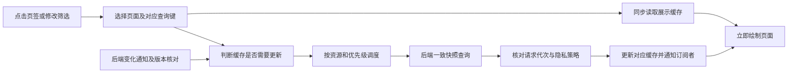

# 页签即时显示与统计更新开发方案

本文规定 TokenPulse 主窗口页签切换、查询缓存、后台更新、分页快照和性能验收的实施方法。目标是让页面切换立即呈现对应内容，让数据读取在后台完成，消除将整个内容区替换成“正在读取统计快照”等等待页面的行为。

方案基于 2026 年 10 月 7 日源码提交 `351fbdd`。下文“当前行为”描述现有实现，“拟新增”和实施阶段描述待开发内容；阶段完成状态统一记录到[实施与交付记录](delivery-status.md)。

## 1 开发目标与交付边界

### 1.1 用户体验目标

用户点击页签后立即看到该页的卡片、表格、筛选及操作区域。已准备好的同范围数据在首次绘制时显示，后台刷新不移除这些内容。页面的出现时间不再取决于统计查询完成时间。

“即时显示”与“数据更新及时”分别验收。前者衡量点击到内容绘制的时间，后者衡量后端提交变化到前端展示新结果的时间。显示上次成功快照可以满足前者，但不能据此宣称后者已经满足。

| 场景 | 目标行为 |
| --- | --- |
| 切换到已缓存页签 | 同步读取对应缓存，首次绘制出现内容 |
| 同范围自动刷新或手动刷新 | 保留上次成功结果，新结果就绪后整体替换 |
| 切回已访问的日期或筛选范围 | 立即恢复该范围结果，后台核对新鲜度 |
| 第一次访问没有缓存的范围 | 立即呈现完整页面结构，未知数字显示 `—`，不显示整块读取页面 |
| 同范围读取失败 | 保留已知内容，以局部错误和重试入口表达失败 |
| 新事件提交或核算发布 | 合并更新通知，重新验证受影响缓存 |
| 服务状态短暂读取失败 | 保留统计快照，显示连接异常；不因一次状态失败清空统计 |
| 隐私策略变化 | 立即封锁旧敏感内容，通过当前策略确认后恢复合规显示 |
| 会话或明细正在浏览后续页 | 保持当前冻结快照和页码，新数据通过提示及明确操作切换 |

初次运行且不存在对应结果时，不能立即提供尚未计算的准确数字。此场景仍必须立即呈现页面结构；不得用旧范围结果或补零代替新范围结果。跨应用重启的已有结果恢复在第八阶段实现，不把只有占位结构的冷启动计为“数据已经即时显示”。

### 1.2 页面范围

覆盖总览、模型、项目、会话、明细、采集诊断和设置。设置包括数据来源、显示与窗口、任务栏显示、价格规则、软件更新，以及各面板中已经存在的账户和通知配置状态。

会话详情、事件依据、筛选候选、小窗和任务栏读数作为受影响的回归范围。它们不能因主窗口预读而失去查询资源或突破现有权限和隐私门禁。

### 1.3 必须保持的正确性

- 同一页中的汇总、费用、覆盖状态和行数据遵循对应快照语义，不拼接不同版本的数据。
- 所有数量和金额保持现有精确整数及定点表示，未知与已知零继续区分。
- 已释放、过期或跨窗口的游标不能继续使用。
- 迟到响应不能覆盖新请求，旧隐私 epoch 的内容不能恢复。
- 新数据提交、历史重建、来源状态和显示名称变化都进入缓存失效判断。
- 本方案不改变原日志、消费核算和价格匹配规则；修改查询和展示层时仍须验证计算结果一致。

## 2 当前实现与问题定位

### 2.1 前端查询链路

当前[主窗口](../../ui/src/app/App.tsx)维护统一筛选，将同一查询范围传给五个保持挂载的统计页面。非活动统计页返回空 DOM，但查询 Hook 仍可后台预读。设置和诊断区域继续使用条件渲染，其面板可能在切换时重新挂载。

| 文件或模块 | 当前行为 | 本次改动 |
| --- | --- | --- |
| [useSnapshotQuery](../../ui/src/app/useSnapshotQuery.ts) | 组件内保存单份结果，范围变化清空，每实例每 10 秒刷新 | 改为共享缓存订阅，由统一控制器更新 |
| [useDashboard](../../ui/src/app/useDashboard.ts) | 包装总览快照读取 | 保留轻量适配职责 |
| [usage-query-scheduler](../../ui/src/app/usage-query-scheduler.ts) | 有有效运行任务时通常不启动下一项，前台优先只影响排队顺序 | 分资源类别调度，合并同键任务，前台请求优先 |
| [usePagedUsage](../../ui/src/app/usePagedUsage.ts) | 缓存最多 10 页，离开后释放租约，条件变化销毁控制器 | 分离展示缓存与活跃租约，按范围恢复页面 |
| [OverviewPage](../../ui/src/app/OverviewPage.tsx) | 无 bundle 时显示整块读取提示 | 固定页面结构，读取状态局部化 |
| [GroupedPage](../../ui/src/app/GroupedPage.tsx) | 无 bundle 时显示分组读取提示 | 从对应缓存恢复表格和汇总 |
| [SessionsPage](../../ui/src/app/SessionsPage.tsx) | 无第一页时显示会话快照读取提示 | 保留工具栏及表格，明确新快照替换 |
| [EventsPage](../../ui/src/app/EventsPage.tsx) | 同样依赖分页 Hook 的结果 | 缓存分页 DTO，避免旧游标恢复 |
| [useMainCalendar](../../ui/src/app/useMainCalendar.ts) | 使用后端解析日历范围，按分钟及刷新条件解析 | 保持后端权威，复用稳定日期范围，跨日重新解析 |
| [SourcesPanel](../../ui/src/app/SourcesPanel.tsx) | 挂载时查询来源，并每 2 秒轮询 | 与主窗口筛选及诊断共享来源状态 |
| [DiagnosticsIssues](../../ui/src/app/DiagnosticsIssues.tsx) | 组件内单份诊断结果，来源变化清空 | 按来源缓存并集中更新 |

重复切换已完成预读的统计页并不必然重新读取。主要等待入口是缓存未准备、筛选变化、组件卸载、状态失败导致的卸载，以及后台查询占用。开发时分别复现这些场景，不能把所有问题归为“切换都会重新请求”。

### 2.2 后端查询资源

[Database](../../crates/token-pulse-store/src/database.rs)有两个普通只读连接。[LeaseService](../../crates/token-pulse-store/src/leases/service.rs)另有两个专用租约工作线程，两套资源独立。普通连接当前等待期限为 5 秒；租约默认总期限 30 秒、空闲期限 10 秒，并受 WAL 大小限制。

总览和分组通过普通读取事务完成。会话、明细、筛选候选及回合分页等使用租约资源。把所有查询放入同一前端串行队列会使本来可以独立进行的工作互相阻塞；仅增加普通连接数也不能解决租约占用。

### 2.3 后端重复计算

[总览 bundle](../../crates/token-pulse-store/src/query/dashboard.rs)顺序完成汇总、覆盖、趋势、热力图、最近会话、费用和版本信息。[分组 bundle](../../crates/token-pulse-store/src/query/groups.rs)再次计算范围汇总与费用，并计算分组覆盖。[明细查询](../../crates/token-pulse-store/src/query/events.rs)在生成页数据时获取范围汇总、覆盖和费用。

项目已有[Token 汇总缓存](../../crates/token-pulse-store/src/query/cached.rs)及[逐事件费用缓存](../../crates/token-pulse-store/src/valuation.rs)，但缓存命中后仍存在遍历、聚合、验证和页面组装。不能把“已有缓存”解释为完整页面结果可以直接返回，也不能假定热力图一定是最慢部分。

### 2.4 现有验收缺口

[导航缓存测试](../../tests/ui/navigation-cache.spec.ts)先等待五个统计页完成预读，再验证多次切换。因此它覆盖准备好后的命中行为，未充分覆盖预读未完成、刚改变范围、租约过期和真实大数据量下的切换。

调度和导航的既有测试是后续回归基础。新增验收必须建立独立的未预热场景，不能让通用初始化步骤提前消除待验证问题。

## 3 修改后的数据流

主窗口持有查询与状态缓存。页面通过订阅读取缓存，调度器执行后台任务，后端在一致快照内返回完整结果。查询完成后缓存通知页面重新绘制。



缓存命中时允许后台更新，但页面切换不等待该任务。未命中时绘制同一页面的结构，等待结果只影响尚未就绪的字段或行区域。

## 4 共享查询缓存

### 4.1 拟新增模块

| 拟新增文件 | 职责 |
| --- | --- |
| `ui/src/app/usage-query-key.ts` | 定义查询种类和规范化键，集中测试范围身份 |
| `ui/src/app/usage-query-cache.ts` | 缓存记录、订阅、结果提交、请求合并和有界淘汰 |
| `ui/src/app/usage-query-controller.ts` | 统一通知、版本核对、前后台预读和刷新策略 |
| `ui/src/app/useUsageQuery.ts` | React 外部缓存订阅适配，可由原 Hook 委托调用 |
| `ui/src/app/paged-usage-cache.ts` | 按范围保存分页展示结果，不保存可恢复的授权 |
| `ui/src/app/main-state-cache.ts` | 来源、诊断和设置只读状态缓存 |

优先保留 `useDashboard`、`useSessions` 和页面组件的适配接口，避免把页面展示细节放入通用缓存。模块名为实施建议，实际新增后同步更新本文的文件映射。

### 4.2 查询身份

前端展示缓存键由以下字段组成：

```text
查询种类 + 规范化请求 + 当前显示隐私 epoch
```

规范化请求必须包含实际 UTC 时间上下界、显示时区、全部维度筛选和计价方式。总览追加趋势粒度与热力图范围；分组追加维度、排序与上限；分页追加排序与页大小。用于展示的名称不替代稳定 ID。

对具有集合语义的 ID 筛选排序和去重，保留 `all`、空集合及 `include_unknown` 的不同含义。不要把价格时点、未知类别或边界时间规范化掉。第一页展示缓存不以 `next_cursor` 为键，后续页归属对应 snapshot ID。

`refreshRevision` 不进入范围身份。手动刷新表示重新验证同一个键，不能通过变更键制造无数据记录。数据修订也不进入前端展示范围键，否则每次新增事件都会失去可立即展示的旧结果；修订存于缓存记录中判断新鲜度。

### 4.3 记录结构与状态

以下为拟新增内部类型，不直接写入生成契约：

```ts
type QueryCacheEntry<T> = {
  value: T | null;
  status: 'idle' | 'fetching' | 'ready' | 'error';
  stale: boolean;
  error: string | null;
  fetchedAt: number | null;
  generation: number;
  invalidationVersion: number;
  inFlight: Promise<void> | null;
};
```

| 状态变化 | 处理规则 |
| --- | --- |
| 没有结果开始读取 | `value=null`，页面结构保持可用 |
| 已有结果开始刷新 | 保留 `value`，进入 fetching |
| 同代次成功返回 | 整体提交对应 bundle，清除该次错误 |
| 读取失败 | 保留 value，记录错误，不将其当作空数据 |
| 读取期间再收到变化 | 增加 invalidationVersion，完成后至多追加一次重新验证 |
| 改变筛选 | 页面同步转向新键，旧键可以继续作为该范围缓存存在 |
| 同键出现新请求代次 | 旧代次响应不能覆盖新代次 |
| 隐私 epoch 变化 | 同步封锁并清除旧策略内容，旧响应不入缓存 |

普通导航离开不等于数据结果失效。旧范围读取完成后可以存入其自身缓存，但不能改变当前页面的范围。共享请求也不能因为一个订阅组件卸载就取消其他订阅者需要的任务。

`useSyncExternalStore` 的快照在记录未变化时必须保持引用稳定；订阅清理由缓存统一管理。React StrictMode 重复挂载不能产生重复 IPC、遗留事件订阅或丢失结果。

### 4.4 缓存容量

普通结果初始上限设为 20 个键，并同时记录估算字节数；建议初始总预算为 16 MiB，后续按实际数据调整。容量数字属于实现初值，不是已测得的内存结论。

优先淘汰最近最少使用且没有活动订阅的记录，保护当前页面和正在读取的记录。所有记录被保护时暂停新增后台预读，不无限扩大缓存。分页继续采用每快照最多 10 页，并设置独立的范围数量及字节预算。

## 5 页面结构与状态处理

### 5.1 统计页

移除总览、分组、会话和明细中以缺少 bundle 为条件返回整块读取提示的分支。卡片标题、表头、排序、页大小、筛选和操作位置保持稳定。

有缓存时显示完整旧 bundle 及实际快照时间，更新只使用轻量局部状态。没有缓存时数字使用 `—`，行区域保持结构；不能显示“暂无消费”或零，因为两者意味着已经得到查询结果。

一次 bundle 返回后原子替换，不能先替换费用再保留旧 Token 或旧覆盖状态。若以后拆分热力图接口，每个独立区域需明确快照身份和一致性规则。

### 5.2 运行状态

调整 `App.tsx`，将最近成功运行状态与本次连接错误分开。一次 `getAppStatus` 失败不撤销已经确认的统计缓存和日期范围。数据库已确认不可用时表达已缓存历史内容与当前服务不可用，不提供依赖连接的写操作。

隐私屏障和普通连接错误走不同路径。`Fragment key={policy.epoch}` 及运行层响应门禁继续有效，缓存清理也必须在 epoch 切换时完成。

### 5.3 日期解析

继续使用 `useMainCalendar` 的后端日历解析，不用前端自行推算日期范围。相同选择和时区解析出的范围不变时，不能仅因对象重建使所有统计失效。跨日、时区变化或实际边界变化时建立新查询键。

历史日期可以命中对应缓存；“今天”等动态范围必须以本次解析的准确上下界核对，不能因标签相同而复用前一天的数据。

## 6 查询调度与资源约束

### 6.1 任务描述

拟扩展调度任务为：

```ts
type UsageQueryTask = {
  key: string;
  resource: 'snapshot' | 'lease';
  priority: 'foreground' | 'background';
  generation: number;
  run: () => Promise<void>;
};
```

任务根据其真实后端实现分类，不根据页面名称猜测。总览、分组属于普通 snapshot；会话、明细、筛选候选和回合分页涉及 lease。任务优先级随活动页面变化更新，并主动触发调度检查。

### 6.2 普通读取

后台 snapshot 最多执行一个。前台缺数据请求可以在总并发不超过两个时启动，避免等待同类后台任务全部完成；这不等于数据库已经为它独占预留连接。

状态、小窗等读取来自其他入口。第二条前台通道启用前，必须测量这些入口是否出现连接等待或超时；若发生争用，在后端增加轻量与交互查询的显式资源保障，而不是无限放大前端并发。

同键任务合并，过时代次的排队任务在开始前清除。已经运行的不可取消 IPC 继续计入并发上限，不能因为其结果失效就假设资源已经释放。后台失败采用有界重试，手动重试可以立即重新排队。

### 6.3 租约读取

保留两个专用槽位的现有边界。后台会话和明细只预读第一页，完成后及时释放租约；需要读取后续页的活动页面与筛选候选、回合查询优先。

前端队列不能完全掌握其他窗口持有的租约。后端槽位耗尽时保留展示结果，进行受控恢复；不能把普通连接空闲当作租约必然可用。租约申请、读取、释放仍串行处理对应控制器。

## 7 会话与明细分页方案

### 7.1 展示缓存与读取控制器分离

展示缓存保存不可变 DTO 页、snapshot ID、页码、已读页边界及 query scope。读取控制器保存活跃 cursor、租约状态、请求代次及释放任务。

离开页签时保存当前展示位置，释放占用的后端租约。缓存可以保留 DTO 中的快照描述，但不可把保存的 cursor 当作恢复授权；已释放后明确将其标记为不可继续读取。

### 7.2 页面恢复规则

| 操作 | 规则 |
| --- | --- |
| 切回已经访问的页面 | 同步恢复原快照当前页 |
| 查看缓存内的上一页或下一页 | 直接切换，不需要后端租约 |
| 查看未缓存的下一页且租约有效 | 在原快照中继续读取 |
| 查看未缓存的下一页但租约失效 | 提供建立新快照的操作，保留当前内容等待结果 |
| 单页缓存需要自动更新 | 新第一页完整返回后整体替换 |
| 已浏览多页且发现新数据 | 提示有新数据，由用户明确切换新快照 |
| 建立新快照成功 | 替换整组页面，回到第一页并明确说明 |
| 新快照读取失败 | 保留旧页码和已读取页，不误报为新的当前数据 |

不能静默从新快照读取第 N 页并追加到旧快照，因为排序位置和总量可能已经变化。新第一页和旧后续页不得同时作为同一个分页序列。

### 7.3 分页校验

保持现有 meta、summary、pricing 和 coverage 一致性校验，重复行键、空续页和页大小校验继续执行。后端复用固定汇总时，生成时间、snapshot ID 及范围描述仍属于原租约，不能每页改为当前时间。

## 8 设置与诊断状态共享

来源列表由主窗口状态缓存管理，供统一筛选、来源设置和诊断共享。[任务栏偏好](../../ui/src/app/TaskbarSettingsPanel.tsx)及[更新状态](../../ui/src/app/UpdateSettingsPanel.tsx)复用已有通知，诊断按来源 ID 保存结果。账户和通知配置采用各自修订与事件，不能错误套用统计 data_revision。

状态缓存只管理已保存状态。价格编辑、任务栏草稿、账户选择和确认步骤由编辑器维护，保存继续携带预期修订号。后台新状态不能覆盖未保存草稿；草稿版本落后时通过现有冲突机制处理。

将现有各面板重复的状态轮询迁移到共享控制器，避免同时保留新旧定时器。配置预读仅调用只读查询，不自动触发网络更新检查、连接账户、检测来源、目录选择或保存操作。

价格规则等敏感编辑器仍受当前隐私门禁控制，不能为了保持挂载而在隐私开启后保留旧文本或确认状态。来源和诊断快照也必须遵循同一清理规则。

## 9 更新通知与版本失效

### 9.1 前端统一更新控制器

移除各查询 Hook 独立的 10 秒重型查询定时器，主窗口只保留一组订阅和核对周期。拟新增 `onUsageChanged` runtime 适配，由 `usage-query-controller.ts` 处理，已有价格与设置事件接入同一失效入口。

初始策略为连续通知合并 200 ms，持续通知最长等待 1 秒便启动一次更新。正在读取时收到变化只记录待更新标记，避免不断取消或并行重启。事件合并时间属于调度初值，实际新数据呈现仍包含排队和查询时间。

窗口隐藏时暂停重型预读，保留失效标记；恢复时先核对版本，更新当前页面，再更新后台常用页。保留一个主窗口统一的低频版本核对，初始周期 30 秒，正常时不直接执行五组重型查询。

### 9.2 拟新增后端版本与事件

建议增加统一的 `usage_view_revision`，覆盖统计查询可观察的变化。新增字段需要通过正式 migration 增加，修改 Rust DTO 后重新生成 TypeScript 和 schema，不手工改生成文件。

拟新增 `get_usage_revision` 轻量命令，返回 data、price 和 usage view 修订。拟新增 `usage_changed` 事件，只携带版本及有限变化类别，不携带来源路径、名称或原始事件。事件使用字符串表示修订，前端用 BigInt 比较。

这些名称均为拟新增接口，当前命令表没有提供。实施时在 `src-tauri/src/query_commands.rs` 定义只读命令，在 `src-tauri/src/lib.rs` 注册，并按现有能力文件补充主窗口权限；小窗权限不自动扩大。

| 变化类别 | 必须核对的失效范围 |
| --- | --- |
| 新消费、必要观察及上下文发布 | 汇总、趋势、分组、会话、明细及相关上下文 |
| 重建或替换候选正式发布 | 受影响消费范围及覆盖，未发布候选不得替换结果 |
| 来源暂停、恢复、缺失或可读性变化 | 来源状态和覆盖，保存的历史消费继续保留 |
| 扫描待确认、未读文件、诊断及待归属变化 | 覆盖和诊断，即使 Token 数量未变化也要更新 |
| 项目别名、会话及来源显示信息变化 | 相关名称、行数据和选项 |
| 价格规则、模型别名或目录变化 | 费用和价格依据，Token 数量不改 |
| 派生缓存就绪 | 可触发性能预热；只有返回内容变化才影响展示版本 |
| 隐私或时区变化 | 显示门禁或查询范围，分别走策略 epoch 和日历解析 |

开发前完成修改入口清单，记录每类事务是否已经推进 data 或 price 修订、还缺少哪些 view 修订。统一 view 修订在事务中原子推进，提交成功后再通知；回滚不推进修订、不发送成功通知。

优先在存储发布路径集中提供通知能力，防止采集、重建、来源配置各自漏发。不得从未提交事务向 UI 推送可见结果，不能在持有数据库连接或事务锁时调用耗时 UI 回调。低频核对用于事件漏收恢复，不能替代遗漏的修订推进。

## 10 后端查询复用

### 10.1 公共范围汇总

拟新增 `crates/token-pulse-store/src/query/summary_cache.rs`，缓存 Token 汇总、费用和覆盖等公共结果。缓存键包含规范化 filter、price_basis、data_revision、price_revision、usage_view_revision 及缓存格式版本；缓存生命周期属于同一个 Database 实例。

读取事务先固定版本，再使用对应键查缓存。未命中时在该事务中计算，发布完整不可变结果。缓存锁只保护查找及提交，不在持锁状态执行 SQL 或等待其他查询。初期允许少量重复计算，避免引入跨事务相互等待。

只有全部影响因素一致时才能复用。当前 snapshot ID、generated_at_ms 和隐私授权不属于共享汇总对象，由具体请求在自己的快照语义中组装。缓存存于后端内部，输出仍执行现有隐私投影。

按缓存命中情况记录汇总、计价遍历次数。对同一范围的五页查询，确认重型公共计算明显减少且结果与无缓存路径一致，不能只统计接口返回速度。

### 10.2 固定租约汇总

会话和明细的第一页产生公共汇总后，在租约生命周期内复用该结果。后续页查询只生成对应行及必要依据。若采用全局汇总缓存，也必须按租约捕获的旧版本查找，不使用当前数据库最新版本。

租约释放、超时、取消或失败时清理关联对象。游标保持现有签名、绑定和权限规则，禁止向 cursor 内塞入未经验证的汇总结果。

### 10.3 热力图优化

先测量 26 周热力图的聚合、覆盖及版本查询耗时，复用实际热力图范围和筛选维度相同的结果。如果它仍显著阻塞总览，再将核心总览和活动热力图分成独立结果。

拆分接口时携带完整版本向量。若要求同一快照展示，必须提供固定快照或版本匹配与受控重试；不能认为两次先后发起的读取自然属于同一版本。不得用拆分接口隐藏跨版本不一致。

## 11 跨应用重启恢复

第一阶段共享缓存只覆盖一次主窗口会话。第八阶段为已有成功结果增加后端持久化展示缓存，解决应用重启后再次预读期间的等待。

持久化内容优先包含最后成功的常用统计范围及必要展示 DTO，不保存分页游标、未保存草稿、账户认证材料或安装确认状态。保存位置遵循[项目目录内的数据与工具缓存](project-local-storage.md)，由后端管理，避免把敏感结果存进 WebView localStorage。

恢复条件必须包含数据库实例身份、缓存格式版本、查询范围与时区、所依赖的修订和当前显示策略。缓存缺失、损坏、版本不兼容或属于其他数据库时忽略并正常查询，不影响数据库启动。

已确认当前隐私策略后才向页面提供恢复结果。恢复记录作为最近成功快照标记待验证，不冒充刚刚生成的最新统计。隐私开启后的持久化与清理流程必须避免旧未脱敏 DTO 在后续响应或错误日志中泄露。

## 12 性能基线与测量

### 12.1 指标定义

| 指标 | 起止点 | 用途 |
| --- | --- | --- |
| 页签呈现耗时 | 导航处理开始到对应内容首次绘制 | 验证切换响应 |
| 排队耗时 | 入队到执行开始 | 判断调度阻塞 |
| IPC 总耗时 | invoke 发起到响应完成 | 观察端到端读取 |
| 后端计算耗时 | 固定快照后到结果组装完成 | 定位 SQL 与计价负担 |
| 数据更新延迟 | 可见变化提交到页面呈现对应版本 | 验证新鲜度 |
| 普通连接和租约等待 | 申请到获得资源 | 防止其他入口退化 |
| 命中率与缓存字节 | 各查询种类的命中和占用 | 调整容量及预读范围 |

计时只记录查询种类、匿名关联 ID、有限阶段、修订及耗时，不输出完整请求、缓存键原文、路径、会话名称或事件正文。跨进程计时分别在各进程使用单调时钟，不能直接相减两个进程的 performance.now。

记录 Windows、WebView2、构建模式、数据规模和缓存状态。首次、预热后、筛选变化及刷新阻塞分别报告；至少重复 100 次有效切换，并提供样本数、P50、P95、最大值和失败次数。

### 12.2 目标与判定

- 缓存命中页签必须在首次绘制提供对应数据；真实 Windows WebView 点击到内容呈现的 P95 目标不超过 100 ms。
- 人为阻塞读取 6 秒及读取失败期间，已缓存页签仍无整块等待页和空白闪烁。
- 未命中页签的完整页面结构同样在首次绘制出现，前台查询按优先级执行。
- 无版本变化时，统一核对不触发五组重型统计刷新。
- 连续变化不会生成无界请求队列或超过声明的并发上限。
- 初次统计和新数据更新延迟在第一阶段测量后确定数值目标，后续阶段必须与基线比较；未经测量不得声明其已达到实时。

## 13 测试矩阵

### 13.1 前端单元测试

拟增加 query key、共享缓存、控制器和分页缓存测试，扩展已有调度测试。

| 测试 | 断言 |
| --- | --- |
| 等价筛选与不同筛选 | 集合顺序不影响键，不同时间、时区、计价和未知类别不能碰撞 |
| 多订阅者请求同键 | 只调用一次读取，单组件卸载不影响其他订阅者 |
| 同范围刷新失败 | value 保留，错误与读取状态正确更新 |
| 读取中发生多次失效 | 无并发风暴，最终补读覆盖最新失效 |
| 请求返回顺序反转 | 旧同键代次不覆盖新结果 |
| 隐私屏障及 StrictMode | 旧 DTO 不恢复，订阅及定时器完整释放 |
| 有界淘汰 | 无订阅旧记录被淘汰，保护记录导致暂停预读而非无限增长 |
| 普通和租约调度 | 队列独立，过期任务不占用资源，运行 IPC 仍计入容量 |
| 分页恢复 | 已缓存页立即可见，释放后的 cursor 不能继续用 |

### 13.2 界面测试

扩展 `navigation-cache.spec.ts` 并保留现有测试。新增测试使用各自初始化步骤，不在通用 beforeEach 中等待所有页完成。

| 编号 | 场景 | 验收断言 |
| --- | --- | --- |
| N01 | 缓存完成后连续切换五页 | 第一帧含正确范围数据，无读取页 |
| N02 | 预读尚未完成就点击其他页 | 页面结构立即出现，目标请求优先 |
| N03 | 今天到近 7 天再回今天 | 立即命中原范围，不出现错范围数字 |
| N04 | 换日期后立即快速切换 | 不显示其他日期结果，迟到响应不改变当前范围 |
| N05 | 自动和手动刷新阻塞及失败 | 当前内容保留，局部错误可重试 |
| N06 | 状态轮询短暂失败后恢复 | 缓存保持，连接状态正确恢复 |
| N07 | 租约释放或到期后返回会话和明细 | 原缓存可读，未缓存续页走明确新快照流程 |
| N08 | 浏览第二页期间采集新数据 | 不跳页、不混合快照 |
| N09 | 隐私变化及迟到响应 | DOM 与缓存均不恢复旧敏感内容 |
| N10 | 设置分区及诊断往返 | 只读快照复用，草稿不被刷新覆盖 |
| N11 | 隐藏恢复及订阅漏收 | 版本核对补更新，单一轮询，无积压 |
| N12 | 跨日及显示时区变化 | 日历身份正确，新旧范围不串用 |
| N13 | 重启恢复有效及损坏缓存 | 有效缓存立即显示，损坏缓存不阻止正常查询 |

### 13.3 后端一致性测试

覆盖相同范围缓存与无缓存结果等价、旧事务遇到并发写入仍保持旧结果、价格变更仅影响对应费用、来源或诊断变化在 Token 不变时仍失效、回滚不发通知、租约公共汇总固定及清理、隐私投影和数据库身份隔离。

计价缓存测试应包括超 JS 安全整数、已知零与未知、多个币种、历史价格和指定时点，不能只比较普通小整数。热力图拆分后补版本不匹配和持续更新下的重试上限测试。

### 13.4 原生与实际数据验收

使用现有隔离开发库验证正式 React、IPC、后端连接和分页租约通路。另以用户已有实际数据规模检查前台切换、小窗更新、状态读取及详情查询是否退化，记录匿名耗时和结果，不把合成夹具当作实际数据性能证据。

原生操作区分程序化 DOM、UI Automation 与物理输入。是否安装候选或发布按具体交付请求处理，不能把开发文档完成或测试通过写成正式包已更新。

## 14 实施阶段与提交要求

每阶段完成一项可独立核对的改动后提交 Git；跨阶段需要前置接口时先提交该接口及测试。阶段状态由交付记录维护，本文保留目标与实施顺序。

| 阶段 | 主要修改 | 完成条件 | 建议提交主题 |
| --- | --- | --- | --- |
| 第一阶段 | 匿名计时、未预热测试、资源基线 | 取得分阶段耗时及初次查询目标 | `test(ui): establish navigation and query latency baseline` |
| 第二阶段 | query key、共享普通缓存、统计页结构、连接错误保留 | N01、N03、N05、N06 通过 | `feat(ui): cache scoped statistics across navigation` |
| 第三阶段 | 分资源调度、任务合并、前台优先 | N02、N04 通过，小窗和轻量查询不退化 | `fix(ui): prioritize foreground usage queries` |
| 第四阶段 | 分页 DTO 缓存、租约恢复、新快照切换 | N07、N08 通过，一致性检查保持 | `feat(ui): restore paged usage views safely` |
| 第五阶段 | 来源、诊断、设置状态共享及草稿边界 | N10 通过，重复订阅和轮询减少 | `refactor(ui): share main window state snapshots` |
| 第六阶段 | view 修订、变更通知、轻量核对、统一更新控制器 | N09、N11、N12 通过，事务变化清单完整 | `feat(usage): notify committed view changes` |
| 第七阶段 | 公共汇总与租约固定汇总复用，必要时优化热力图 | 缓存等价及旧快照测试通过，重复计算减少 | `perf(store): reuse consistent usage summaries` |
| 第八阶段 | 后端持久化恢复及实际 Windows 验收 | N13 和全部指标通过，交付记录写明构建身份 | `feat(ui): restore validated statistics on startup` |

第三阶段的资源并发取决于第一阶段实测。第六阶段建立完整 view 修订后，第七阶段才可以用它作为后端共享缓存失效依据。第八阶段依赖完整修订和隐私校验，不提前存储未经验证的页面结果。

## 15 开发检查与交付清单

### 15.1 常用验证命令

以下命令在仓库根目录执行。按修改范围选择测试，Rust 命令先加载仓库环境，生成契约通过项目脚本运行。

```powershell
# 前端类型、单元测试和界面测试
npm run typecheck
npm test -- ui/src/app/usage-query-scheduler.test.ts
npm run test:e2e -- tests/ui/navigation-cache.spec.ts
npm run build

# 修改核心或存储模块后
. ./scripts/project-env.ps1
cargo test -p token-pulse-core
cargo test -p token-pulse-store
cargo fmt --all -- --check
cargo clippy -p token-pulse-core -p token-pulse-store --all-targets -- -D warnings

# 修改 IPC 契约后
npm run contracts
npm run contracts:check

# 桌面编译及现有原生通路回归
cargo check -p token-pulse-desktop
npm run test:native
```

新增测试文件后把对应定向命令加入阶段交付记录。修改采集或发布通知路径时补对应 collector 测试；不以 UI 测试替代真实事务检查。原生脚本的独立进程、快捷键和正式实例约束遵循[本地开发与运行](local-development.md)。

### 15.2 文档与提交

- 更新交付记录中的阶段完成情况，附提交、命令结果及性能报告位置。
- 变更 Rust 契约时提交相应 TypeScript、schema 和能力配置，写明兼容边界。
- 保存前后性能报告和必要截图，不纳入真实日志、账户材料或原始查询请求。
- Git 提交只包含本模块改动，保留工作区中用户已有的未提交内容。
- 索引只链接已存在文档。后续拆分需求或设计专题时按[仓库文档索引](../README.md)分类，并使用相对链接互引。

### 15.3 完成判据

全部目标页签按对应范围显示缓存，刷新不清空已有内容；无缓存时立即显示正确页面结构；分页和隐私约束全部通过；数据更新与连接资源没有退化；真实 Windows 切换指标达到目标。仅移除读取文案、仅等待预读完成后测试、仅交付未安装的构建产物，均不能单独判定本方案已完成。

## 16 相关实现与设计

- [IPC 与前端契约](../design/ipc-contracts.md)
- [数据与存储详细设计](../design/data-storage.md)
- [TokenPulse UI 设计](../design/token-pulse-ui.md)
- [开发实施与验收计划](implementation-plan.md)
- [本地开发与运行](local-development.md)
- [实施与交付记录](delivery-status.md)

## 17 实施入口审计（2026-10-07）

当前新增 `usage-query-key` / `usage-query-cache` / `paged-usage-cache` / `main-state-cache` / `usage-query-controller`，原 Hook 委托共享结果；设置和诊断保存已访问面板。阶段验证见交付记录，完整原生性能判据保持。

schema 15 通过数据库触发器在原事务内推进 usage_view_revision，避免不同采集与维护入口漏发。writer 返回后才调用匿名 UsageRevision 回调，通知主窗口；回滚不通知。修订为保守失效，可以多失效，不允许少失效。

| 入口 | 修订依据 |
| --- | --- |
| batch / collection / canonical 发布消费 | app_state data / usage_events / event_provenance / observations |
| rebuild / replacement 正式切换 | ledger_generations / sessions 活跃指针及 data |
| source_management 暂停、恢复、路径与能力 | sources 全部实际字段变化 |
| source_scan 开始、确认、完成、中断 | source_scan_state / source_scan_files / source_files / file_generations |
| diagnostics recheck / 诊断写入 | diagnostics / pending_usage |
| registration / 项目别名及会话显示关系 | projects / sessions / session_aliases / file_session_bindings |
| context 更新 | context_snapshots |
| pricing / model alias / offline catalog | app_state price |
| 通知接入保存 | notify_integrations；账户设置继续沿用 settings 与 quota 事件 |
| 纯派生 rollup / valuation 填充 | 不推进 view，结果仍遵循原权威规则 |

候选 spool 不直接推进消费版本；保守 metadata 失效仍查询原活跃账本。每个触发器 UPDATE 使用字段实际变化判断，同值写入不推进。数据库身份为持久随机 128-bit ID，版本命令仅主窗口权限；mini 权限未扩展。轮询失败不撤销缓存，迟到旧版本不回退。


## 18 已实现的缓存与资源边界（2026-10-07）

八个阶段均已落入实现，最终原生回执和限制见[交付记录](delivery-status.md)。导航点击同步提交页面选择；页面直接使用当前完整查询身份的成功 DTO，缺失则展示页面结构和未知占位。普通缓存最多 20 个成功范围 / 16 MiB；在用结果不被后台预读挤走，受保护结果占满容量时不启动新后台预读，超限刷新保留旧成功结果。只读来源和诊断共享，已访问设置保持编辑草稿，账户与通知只读状态及事件传输合并；所有保存和外部动作仍是显式入口。

分页展示保存最多十个范围、每范围十页、整体 16 MiB；修订变化期间用户已经翻页时只提示有更新，显式重新查询成功后才整体替换并回到第一页。DTO 中没有续页授权，活跃控制器串行管理租约；已释放、临近到期或异常授权必须重建。后端公共汇总 LRU 最多 20 项 / 16 MiB，同完整版本及范围合并计算，租约另持有固定汇总直至释放或过期。结果仍从同一权威 SQLite 快照读取，不拼接不同版本。

主窗口统计调度总并发三项：普通快照两项，其中后台最多一项；分页查询一项。实际连接分为后台二、统计二、交互二、轻量一，以及两个分页 actor 和一个 writer，总计十个。交互第二连接根据真实小窗重复请求的排队证据保留，避免小窗与详情相互串行。查询无法取消时仍计入调度容量；候选和回合继续使用后端有界租约。

schema 16 的重启恢复是后端持久完整成功结果，最多 20 范围 / 16 MiB；检查数据库随机身份、格式、大小、完整规范请求、data / price / view 修订及当前隐私。隐私启用在提交内清空全部持久结果，迟到保存必须通过完整设置代次复核；恢复响应也经过最新隐私投影。主题和位置保存可推进 settings 修订，只有统计版本相同且当前未隐藏时才复用旧结果。分页恢复仅包含页内容及 has_more，不恢复游标、编辑草稿、账户确认或通知确认。恢复内容明确标示为上次成功快照，后台新读取成功后整体替换。

后台日历解析仍由 Rust 提供；前端复用期限来自权威热力图结束日界，包含自定义固定范围的每日热力图更新。系统时钟回退、跨日、时区改变和新范围均重新核对身份；不在前端用 UTC 字符串猜测本地日期。

真实原生探针只允许 debug Windows / --native-smoke / 合法随机副本目录，原数据库通过只读备份取得。采集及派生服务在副本完成正常启动后停止，统计、IPC 和提交后通知仍走生产通路。所有测试窗口在显示前放到副屏；报告只记录匿名数量、阶段和时长，不包含名称、请求、费用或原始内容。重启阶段在统计 IPC 被阻塞时要求先出现恢复数据和明确说明；未预热阶段先检查五页结构，再等待各自真实查询，独立于全部预读完成的暖缓存测试。


首次范围汇总新增数量 / 覆盖 / 计价 / 版本匿名分段。历史计价读取固定从已有 event+input fingerprint 索引开始，在同一快照内再验证完整发布版本；不能让优化器从所有历史 ready 集合出发逐事件探测。验收增加历史集合增长的确定性 SQLite VM 工作量测试，仍覆盖矛盾结果回退、旧价格快照、未知值和精确核算。未预热范围与更新延迟单独报告，不以暖缓存毫秒结果替代。


最终回执采用真实副屏 WebView2 和实际 3 GB 数据副本，既验证未预热范围，也验证 IPC 阻塞时重启恢复。当前缓存导航首次 rAF P95 15.6ms / 后续帧 18.5ms，未预热 7 / 30 天范围 1.44 / 3.07s；来源显示更新 1.01s。测量包含程序化 DOM click，未覆盖硬件输入到 DWM 合成；开发构建未安装到现有应用。数据库启动约 9–10s 单独报告。详情、回执、验证及剩余边界见交付记录 I11，不以此文原方案或旧阶段状态替代实际结果。


用户要求继续压缩秒级路径后，来源健康覆盖改为同一事务内复用，细分待核对与未归属数量仍按每个模型 / 项目 / 会话 / 日期独立读取。计价候选头部按完整版本一次选择，逐事件限制至每账本最新两个合格集合；候选缺失、输入指纹不匹配、非法或矛盾结果均回退权威计价。新增独立覆盖查询等价回归和匿名 SQL / 解析 / 查找 / 计价 / 累积计时。阶段实测见交付记录 I12，秒级残留继续单独记录。
